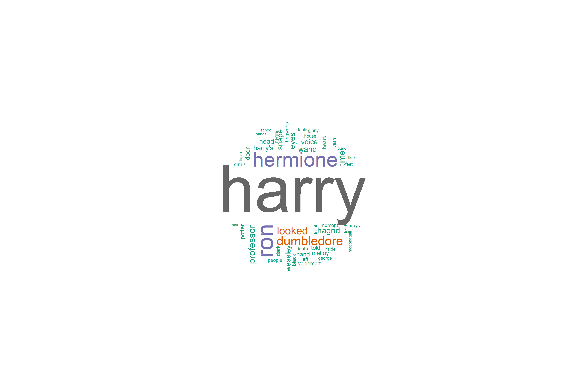

## Background Information

Harry Potter is one of the bestselling series of all time. More than 400 million copies of Harry Potter titles have been sold worldwide, and they have been translated into 68 languages. For more information: [Wiki](https://en.wikipedia.org/wiki/Harry_Potter).

## Data Sources

The text data used in this analysis was obtained from R package (harrypotter) on GitHub containing the text for all 7 books in the Harry Potter series, by JK Rowling. https://github.com/bradleyboehmke/harrypotter

We used basic web scraping on https://en.wikipedia.org to extract character details.

## Quantitative and Sentimental Analysis

###Q1. who is the most important charecter based on how much they were mentioned 


Harry Potter is the most frequently mentioned character in the series.

###Q2. Which is the most scariest book based on sentiment analysis ?


Using bing lexicon, Harry Potter and the Order of the Phoenix is the scariest with about 8k negative sentiments,

###Q3. What the top ten used words in exception to stop words ?


```{r  echo=FALSE}
load("data/q3.Rda")
knitr::kable(head(word_count, 10))
```


###Q4. How doeas sentiment differ from one book to the next?


Order of the Phoenix, Half-blood Prince and Deathly Hallows use more negatvie sentiments compared to earlier series.


###Q5. How does negative sentiments changes over time? Is there any similarities in the 1st and last chapter?


The order of phoenix and Deathly Hallow have a steeper dive into negative sentiments toward the later chapters.

###Q6.How does sentiment changes from one chapter to the next for each book? Which book has the highest variation?


Harry Potter and the Deathly Hallows has the highest sentimental variation. 

###Q7. What is the frequency distribution of words for each Harry Potter Book


These plots exhibit similar distributions for all the books, with most of the words occuring rarely and fewer words that occur frequently.

###Q8.How does positive sentiment change over time. Does the author has a specific pattern of control of positive sentiment?


###Q9.How frequently did  the top 8 most popular characters appear in the last book?
