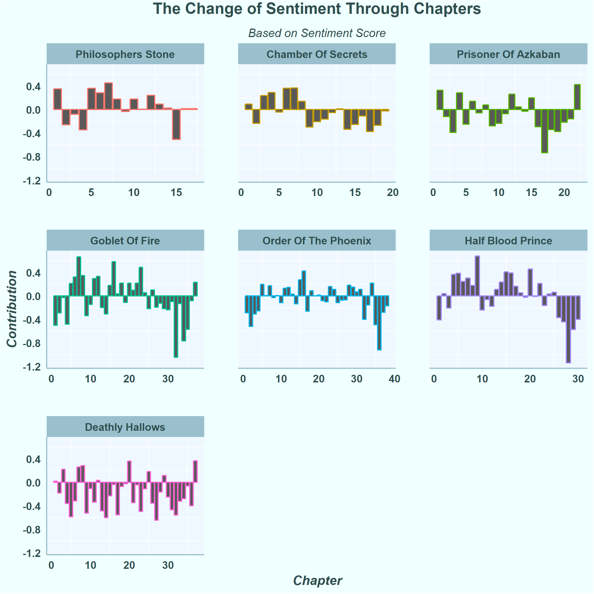

## Frequency Analysis
###1. Who is the most important charecter based on how much he/she was mentioned 

Harry being the main character in the entire series, it’s clear that his name is mentioned with highest frequency. The author did a pretty nice job 

###2. The Difference of Frequency Between Ron and Hermione

 Using bing lexicon, Harry Potter and the Order of the Phoenix is the scariest with about 8k negative sentiments

###3. What are the top ten used words in exception to stop words ?

###4. what is the most scariest book based on sentiment analysis ?

###5. Sentiment by book

###6. The change of "anger" through chapters

###7. How does sentiment change through chapter?

###8. Sentiment by popularity

###9. Term Frequency

###10. Zipf's Law

###11. N-grams

