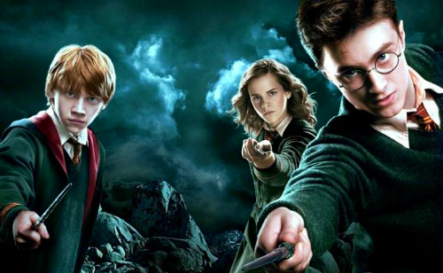
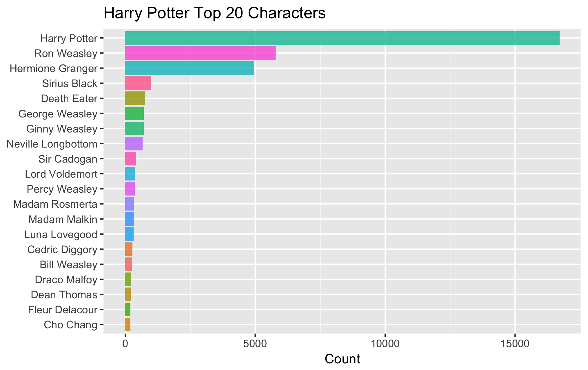
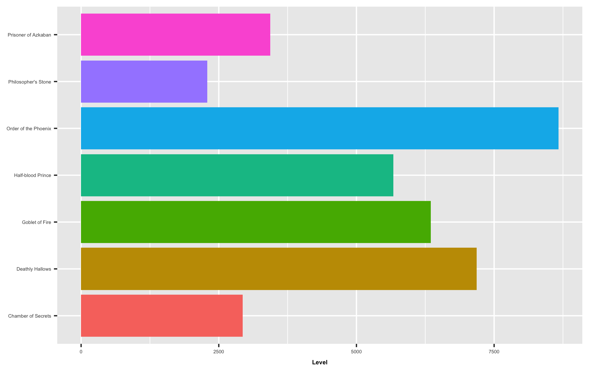
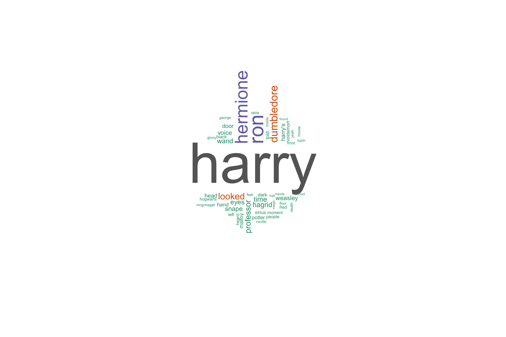
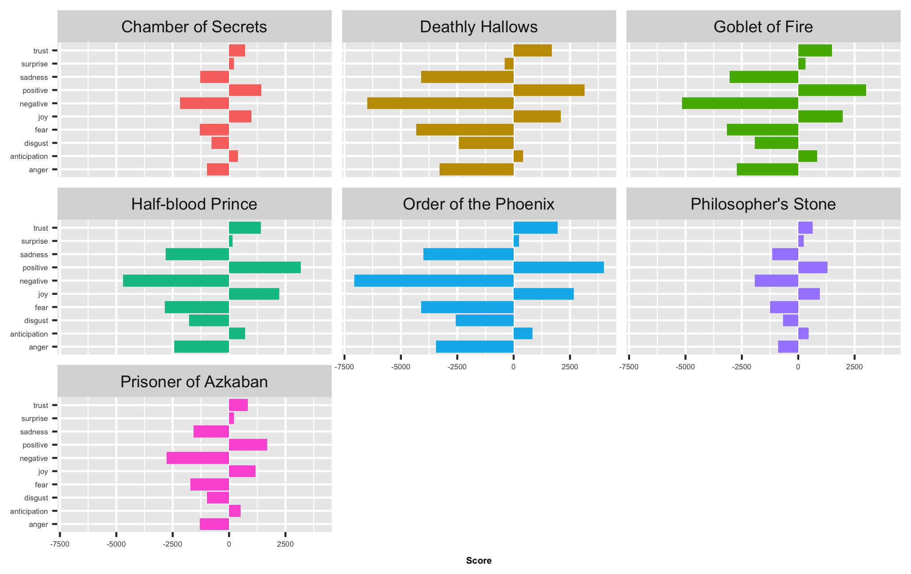
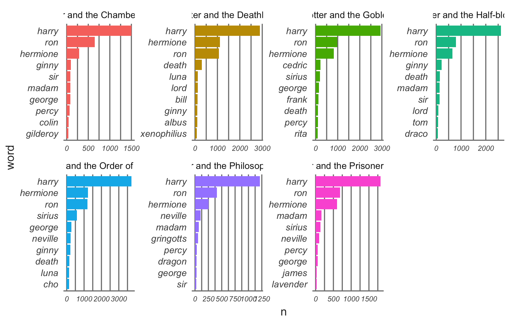

## Background Information
Harry Potter is a series of fantasy novels written by British author J. K. Rowling. The world was introduced to Harry Potter on June 26, 1997.Twenty years later, Harry Potter and the Philosophers Stone, the first book in the series, is one of the bestselling books of all time. According to Scholastic, more than 400 million copies of Harry Potter titles have been sold worldwide, and they’ve been translated into 68 languages. For more information: [Wiki](https://en.wikipedia.org/wiki/Harry_Potter).

Harry Potter being one of the most popular novel, we though we should try do some basic yet informative frequency & sentimental analysis

## The Data

The text data used in this analysis was obtained from R package (harrypotter) on GitHub containing the text for all 7 books in the Harry Potter series, by JK Rowling. https://github.com/bradleyboehmke/harrypotter

We had to extract other metadata like  publisher, ranking, sales, author e.t.c from https://www.theguardian.com/us

We got our hands dirty by doing some basic web scraping on https://en.wikipedia.org to extract character details.

Now let's do some analysis!

## Quantitative and Sentimental Analysis
###Q1. Who is the most important charecter based on how much he/she was mentioned 

Harry being the main character in the entire series, it’s clear that his name is mentioned with highest frequency. The author did a pretty nice job 

###Q2. Which is the most scariest book based on sentiment analysis ?


 Using bing lexicon, Harry Potter and the Order of the Phoenix is the scariest with about 8k negative sentiments

###Q3. What the top ten used words in exception to stop words ?


```{r  echo=FALSE}
load("data/hp_word_count.q3.Rda")
knitr::kable(head(word_count, 10))
```


###Q4. sentiments by books 


Order of the Phoenix, Deathly Hallows, Half-blood Prince and Deathly Hallows use more negatvie sentiments while the rest use more positive sentiments

###Q5. sentiment by popularity based on www.theguardian.com


Looks like negative sentimental score is proportional to the sale/Popularity. Books which had more negative words resulted in higher sales

###QS. /Nour/ most mentioned characters by book 
