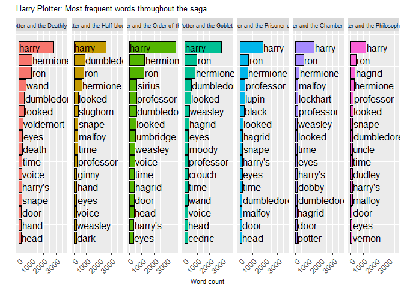
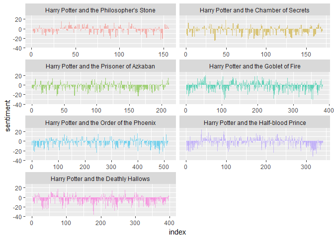
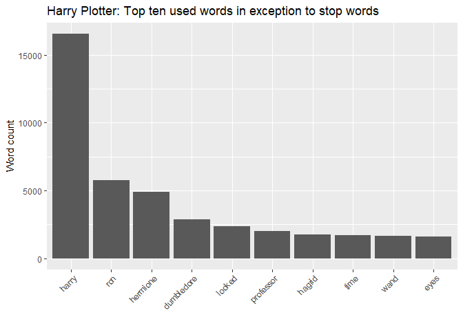
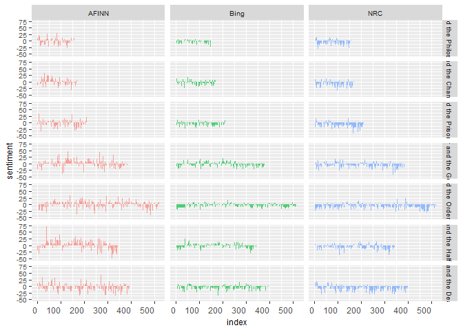
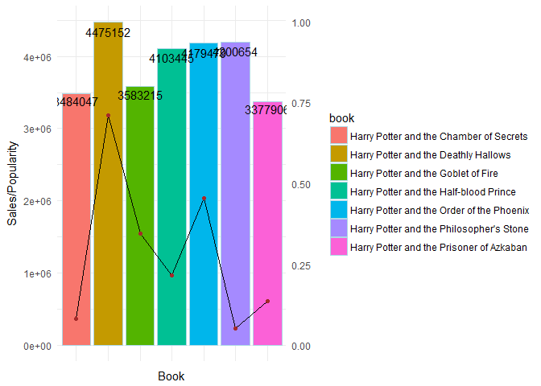
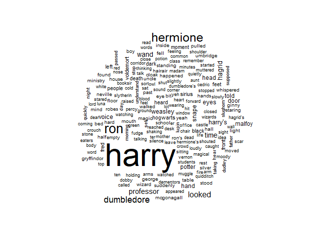
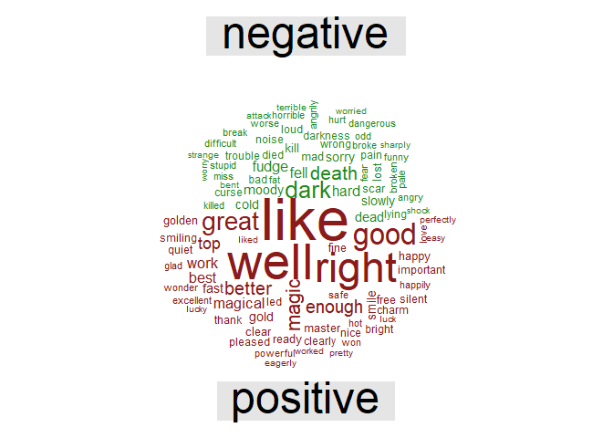
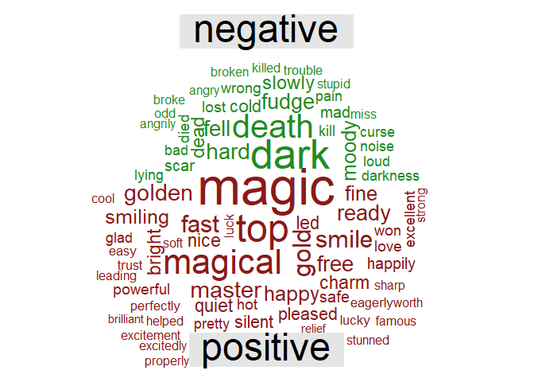
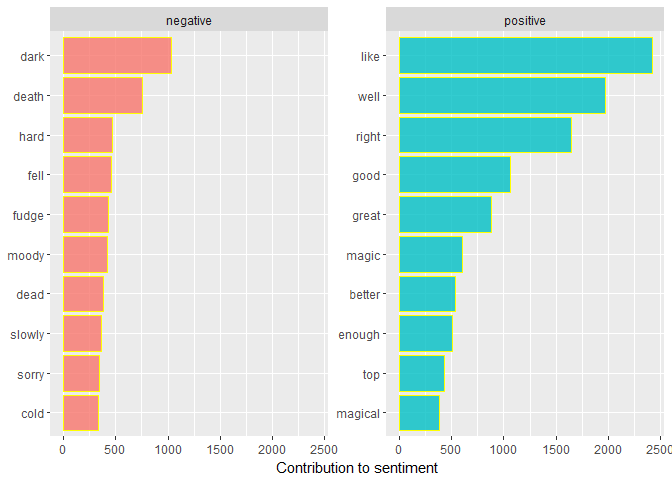

```{r setup, include=FALSE}
knitr::opts_chunk$set(echo = TRUE)
```


# 0. Setup


# 1.Data preparation
## 1.1 Shape the data.
## 1.2 Place all of the books in the Harry Potter series into a tibble. Then tokenize the text into single words, strip away all punctuation and capitalization, and add columns to the tibble for the book and chapter.
## 1.3 Keep books in order of publication.


# 2. Group Question Sets
## 2.1 Which is the most important charecter based on how much it was mentioned? 


##### As we can imagine, Harry is the most common word in every single book and Ron and Hermione are also present. So Harry is the most important character based on how much it was mentioned. 


## 2.2 Which is the most scariest book based on sentiment analysis?


##### From the graph, we can find that Deathly Hallows is the most scariest books based on sentiment analysis.

## 2.3 What are the top ten used words in exception to stop words?


## 2.4 Sentiments by books


## 2.5 Sentiment by popularity based Guardian data.

## 3. Unique questions.

## 3.1 Wordcloud


## 3.2 Comparison cloud with stop words.


## 3.3 Comparison cloud without stop words.


## 3.4 Analyze word counts that contribute to each sentiment. Can we view this visually?

 