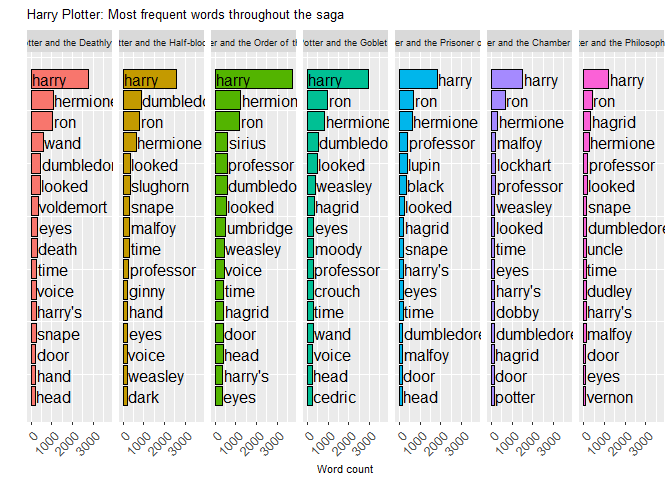
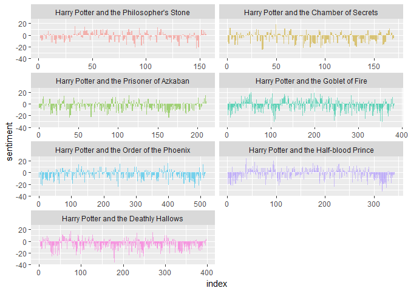
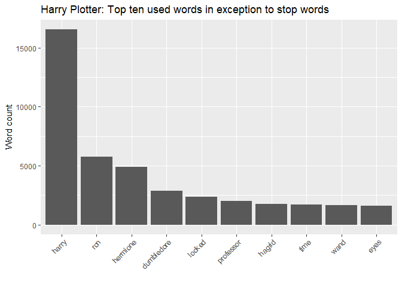
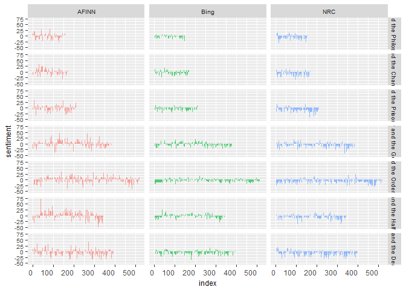
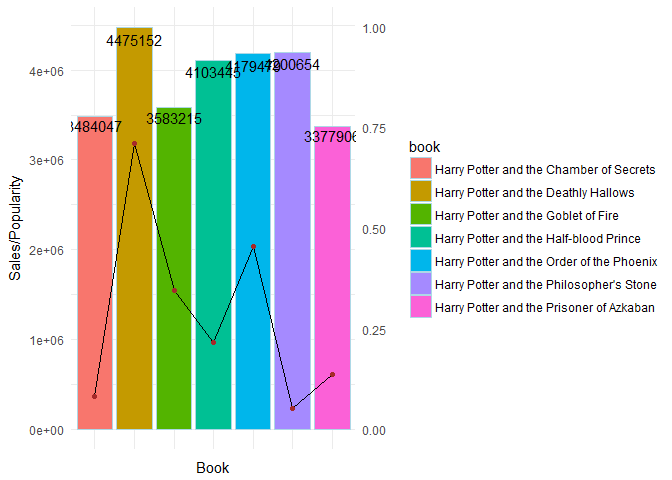
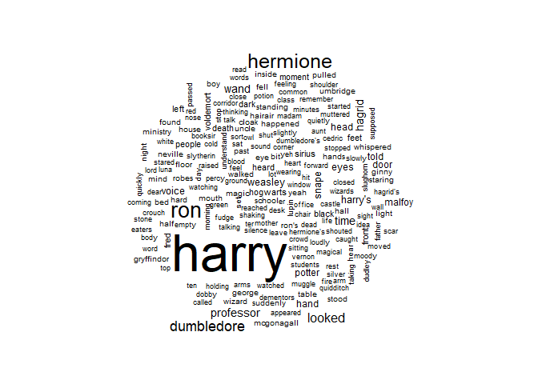
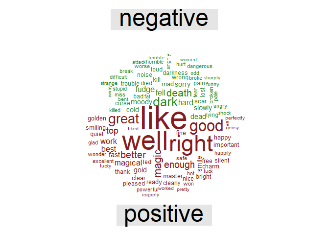
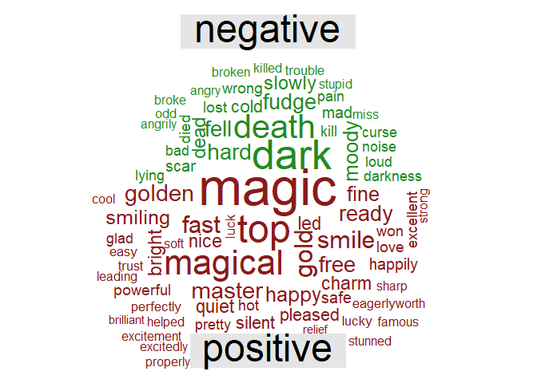
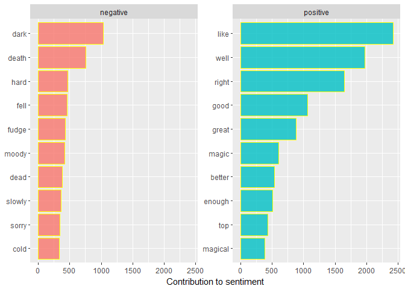

Text Analyis
================
Wei Wang
10/18/2017

0. Setup
========

``` r
# Load in packages.

library(wordcloud)
library(devtools)
library(tidyverse)      
library(stringr)        
library(tidytext)
library(dplyr)
library(reshape2)
library(igraph)
library(ggraph)
library(ggplot2)

    if (packageVersion("devtools") < 1.6) {
  install.packages("devtools")
}

devtools::install_github("bradleyboehmke/harrypotter")
```

1.Data preparation
==================

1.1 Shape the data.
-------------------

``` r
hp_books <- c("Harry Potter and the Philosopher's Stone", 
            "Harry Potter and the Chamber of Secrets", 
            "Harry Potter and the Prisoner of Azkaban",
            "Harry Potter and the Goblet of Fire", 
            "Harry Potter and the Order of the Phoenix", 
            "Harry Potter and the Half-blood Prince",
            "Harry Potter and the Deathly Hallows"
            )

hp_list <- list(harrypotter::philosophers_stone, 
                harrypotter::chamber_of_secrets, 
                harrypotter::prisoner_of_azkaban,
                harrypotter::goblet_of_fire, 
                harrypotter::order_of_the_phoenix, 
                harrypotter::half_blood_prince,
                harrypotter::deathly_hallows
                )
```

1.2 Place all of the books in the Harry Potter series into a tibble. Then tokenize the text into single words, strip away all punctuation and capitalization, and add columns to the tibble for the book and chapter.
---------------------------------------------------------------------------------------------------------------------------------------------------------------------------------------------------------------------

``` r
##Each book is an array in which each value in the array is a chapter 
series <- tibble()
for(i in seq_along(hp_books)) {
  temp <- tibble(book = seq_along(hp_list[[i]]),
                  text = hp_list[[i]]) %>%
    unnest_tokens(word, text) %>%
##Here I tokenize each chapter into words
    mutate(book = hp_books[i]) %>%
    select(book, everything())
  
  series <- rbind(series, temp)
}
```

1.3 Keep books in order of publication.
---------------------------------------

``` r
series$book <- factor(series$book, levels = rev(hp_books))
series
```

    ## # A tibble: 1,089,386 x 2
    ##                                        book    word
    ##  *                                   <fctr>   <chr>
    ##  1 Harry Potter and the Philosopher's Stone     the
    ##  2 Harry Potter and the Philosopher's Stone     boy
    ##  3 Harry Potter and the Philosopher's Stone     who
    ##  4 Harry Potter and the Philosopher's Stone   lived
    ##  5 Harry Potter and the Philosopher's Stone      mr
    ##  6 Harry Potter and the Philosopher's Stone     and
    ##  7 Harry Potter and the Philosopher's Stone     mrs
    ##  8 Harry Potter and the Philosopher's Stone dursley
    ##  9 Harry Potter and the Philosopher's Stone      of
    ## 10 Harry Potter and the Philosopher's Stone  number
    ## # ... with 1,089,376 more rows

2. Group Question Sets
======================

2.1 Which is the most important charecter based on how much it was mentioned?
-----------------------------------------------------------------------------

``` r
# PLOT WORD FREQUENCY PER BOOK
series %>%
  group_by(book, word) %>%
  anti_join(stop_words, by = "word") %>% # delete stopwords
  count() %>% # summarize count per word per book
  arrange(desc(n)) %>% # highest freq on top
  group_by(book) %>% # 
  mutate(top = seq_along(word)) %>% # identify rank within group
  filter(top <= 16) %>% # retain top 15 frequent words
  # create barplot
  ggplot(aes(x = -top, fill = book)) + 
  geom_bar(aes(y = n), stat = 'identity', col = 'black') +
  # make sure words are printed either in or next to bar
  geom_text(aes(y = ifelse(n > max(n) / 2, max(n) / 50, n + max(n) / 50),
                label = word), size = 15/3.5, hjust = "left") +
  theme(legend.position = 'none', # get rid of legend
        text = element_text(size = 8), # determine fontsize
        axis.text.x = element_text(angle = 45, hjust = 1, size = 15/1.5), # rotate x text
        axis.ticks.y = element_blank(), # remove y ticks
        axis.text.y = element_blank()) + # remove y text
  labs(y = "Word count", x = "", # add labels
       title = "Harry Plotter: Most frequent words throughout the saga") +
  facet_grid(. ~ book) + # separate plot for each book
  coord_flip() # flip axes
```



##### As we can imagine, Harry is the most common word in every single book and Ron and Hermione are also present. So Harry is the most important character based on how much it was mentioned.

2.2 Which is the most scariest book based on sentiment analysis?
----------------------------------------------------------------

``` r
# Use the nrc sentiment data set to assess the different sentiments that are represented across the Harry Potter series.
series %>%
        right_join(get_sentiments("nrc")) %>%
        filter(!is.na(sentiment)) %>%
        count(sentiment, sort = TRUE)
```

    ## # A tibble: 10 x 2
    ##       sentiment     n
    ##           <chr> <int>
    ##  1     negative 56579
    ##  2     positive 38324
    ##  3      sadness 35866
    ##  4        anger 32750
    ##  5        trust 23485
    ##  6         fear 21544
    ##  7 anticipation 21123
    ##  8          joy 14298
    ##  9      disgust 13381
    ## 10     surprise 12991

``` r
# Find how the sentiment changes over the course of each novel.
series %>%
        group_by(book) %>% 
        mutate(word_count = 1:n(),
               index = word_count %/% 500 + 1) %>% 
        inner_join(get_sentiments("bing")) %>%
        count(book, index = index , sentiment) %>%
        ungroup() %>%
        spread(sentiment, n, fill = 0) %>%
        mutate(sentiment = positive - negative,
               book = factor(book, levels = hp_books)) %>%
        ggplot(aes(index, sentiment, fill = book)) +
          geom_bar(alpha = 0.5, stat = "identity", show.legend = FALSE) +
          facet_wrap(~ book, ncol = 2, scales = "free_x")
```



##### From the graph, we can find that Deathly Hallows is the most scariest books based on sentiment analysis.

2.3 What are the top ten used words in exception to stop words?
---------------------------------------------------------------

``` r
used_words <- series %>%
  group_by(word) %>%
  anti_join(stop_words, by = "word") %>% # delete stopwords
  count() # summarize count per word per book
# Plot the top ten used words in exception to stop words
words_freq <- as.data.frame(used_words)   
ggplot(subset(words_freq, n>1600), aes(x = reorder(word, -n), y = n)) +
          geom_bar(stat = "identity") + 
          theme(axis.text.x=element_text(angle=45, hjust=1)) +
          labs(y = "Word count", x = "", # add labels
          title = "Harry Plotter: Top ten used words in exception to stop words")
```



2.4 Sentiments by books
-----------------------

``` r
afinn <- series %>%
        group_by(book) %>% 
        mutate(word_count = 1:n(),
               index = word_count %/% 500 + 1) %>% 
        inner_join(get_sentiments("afinn")) %>%
        group_by(book, index) %>%
        summarise(sentiment = sum(score)) %>%
        mutate(method = "AFINN")

bing_and_nrc <- bind_rows(series %>%
                  group_by(book) %>% 
                  mutate(word_count = 1:n(),
                         index = word_count %/% 500 + 1) %>% 
                  inner_join(get_sentiments("bing")) %>%
                  mutate(method = "Bing"),
          series %>%
                  group_by(book) %>% 
                  mutate(word_count = 1:n(),
                         index = word_count %/% 500 + 1) %>%
                  inner_join(get_sentiments("nrc") %>%
                                     filter(sentiment %in% c("positive", "negative"))) %>%
                  mutate(method = "NRC")) %>%
        count(book, method, index = index , sentiment) %>%
        ungroup() %>%
        spread(sentiment, n, fill = 0) %>%
        mutate(sentiment = positive - negative) %>%
        select(book, index, method, sentiment)

bind_rows(afinn, bing_and_nrc) %>%
        ungroup() %>%
        mutate(book = factor(book, levels = hp_books)) %>%
  ggplot(aes(index, sentiment, fill = method)) +
  geom_bar(alpha = 0.65, stat = "identity", show.legend = FALSE) +
  facet_grid(book ~ method) +
  theme(legend.position = 'none', # get rid of legend
        text = element_text(size = 9), # determine fontsize
        axis.text.x = element_text(hjust = 1, size = 9))
```



2.5 Sentiment by popularity based Guardian data.
------------------------------------------------

``` r
seriesinfo <- read.csv("https://docs.google.com/spreadsheets/d/1dhxblR1Vl7PbVP_mNhwEa3_lfUWiF__xSODLq1W83CA/export?format=csv&id=1dhxblR1Vl7PbVP_mNhwEa3_lfUWiF__xSODLq1W83CA&gid=0")
popularity<-subset(seriesinfo,Author=="Rowling, J.K." & Title != "Tales of Beedle the Bard,The")
popularity$Volume.Sales <- c("4,475,152", "4,200,654", "4,179,479", "3,583,215", "3,484,047", "3,377,906", "2,950,264", "4,103,445")
as.numeric(popularity$Volume.Sales)
```

    ## [1] NA NA NA NA NA NA NA NA

``` r
colnames(popularity)[colnames(popularity) == 'Title'] <- 'book'


hp_by_sales <- series%>%
  # join nrc to get sentiment value
  inner_join(get_sentiments("nrc"), by = "word") %>%
  # join nrc to get sentiment score
  inner_join(get_sentiments("afinn"), by = "word") %>%
  group_by(book)%>%
  summarise(count=sum(score)) %>%
  mutate(perc_sentiment=(count/sum(count))*2) %>%
  arrange(desc(perc_sentiment))%>%
  inner_join(popularity, by = "book")%>%
  mutate(sales=as.numeric(gsub(",","",Volume.Sales)))
  


df<- data.frame(hp_by_sales)
# plot the graph
ggplot(df)  + 
  geom_bar(aes(x=book, y=sales,  fill=book),stat="identity", col = "lightblue")+
  geom_line(aes(x=book, y=perc_sentiment*max(df$sales)),group=1)+
  geom_point(aes(label=perc_sentiment, x=book, y=perc_sentiment*max(df$sales)), colour="brown")+
  geom_text(aes(label=sales, x=book, y=0.97*sales), colour="black")+
  scale_y_continuous(sec.axis = sec_axis(~./max(df$sales)))+
  labs(x = "Book", y = "Sales/Popularity")+
  theme_minimal()+
  theme(
    axis.text.x=element_blank(),
    axis.ticks.x=element_blank())
```



3. Unique questions.
--------------------

3.1 Wordcloud
-------------

``` r
series$book <- factor(series$book, levels = rev(hp_books))
series %>% 
  anti_join(stop_words) %>%
  count(word) %>%
  with(wordcloud(word, n, max.words = 200))
```

    ## Joining, by = "word"



3.2 Comparison cloud with stop words.
-------------------------------------

``` r
series %>%
  inner_join(get_sentiments("bing")) %>%
  count(word, sentiment, sort = TRUE) %>%
  acast(word ~ sentiment, value.var = "n", fill = 0) %>%
  comparison.cloud(colors = c("forestgreen", "firebrick4"),
                   max.words = 100)
```

    ## Joining, by = "word"



3.3 Comparison cloud without stop words.
----------------------------------------

``` r
series %>%
  anti_join(stop_words) %>%
  inner_join(get_sentiments("bing")) %>%
  count(word, sentiment, sort = TRUE) %>%
  acast(word ~ sentiment, value.var = "n", fill = 0) %>%
  comparison.cloud(colors = c("forestgreen", "firebrick4"),
                   max.words = 80)
```



3.4 Analyze word counts that contribute to each sentiment. Can we view this visually?
-------------------------------------------------------------------------------------

``` r
counting_bing_word <- series %>%
  inner_join(get_sentiments("bing")) %>%
  count(word, sentiment, sort = TRUE) %>%
  ungroup()

counting_bing_word
```

    ## # A tibble: 3,313 x 3
    ##      word sentiment     n
    ##     <chr>     <chr> <int>
    ##  1   like  positive  2416
    ##  2   well  positive  1969
    ##  3  right  positive  1643
    ##  4   good  positive  1065
    ##  5   dark  negative  1034
    ##  6  great  positive   877
    ##  7  death  negative   757
    ##  8  magic  positive   606
    ##  9 better  positive   533
    ## 10 enough  positive   509
    ## # ... with 3,303 more rows

``` r
# We can view this visually.
counting_bing_word %>%
        group_by(sentiment) %>%
        top_n(10) %>%
        ggplot(aes(reorder(word, n), n, fill = sentiment)) +
          geom_bar(alpha = 0.8, stat = "identity", show.legend = FALSE, col = "yellow") +
          facet_wrap(~sentiment, scales = "free_y") +
          labs(y = "Contribution to sentiment", x = NULL) +
          coord_flip()
```


