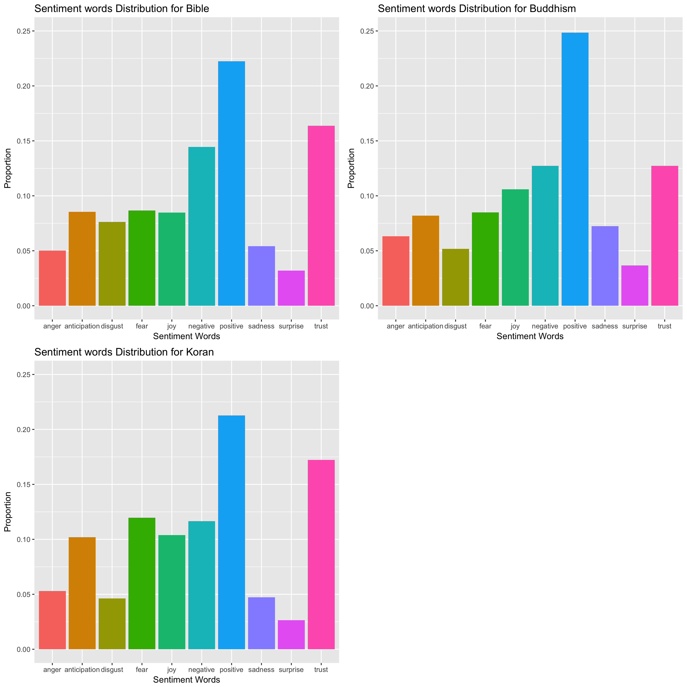
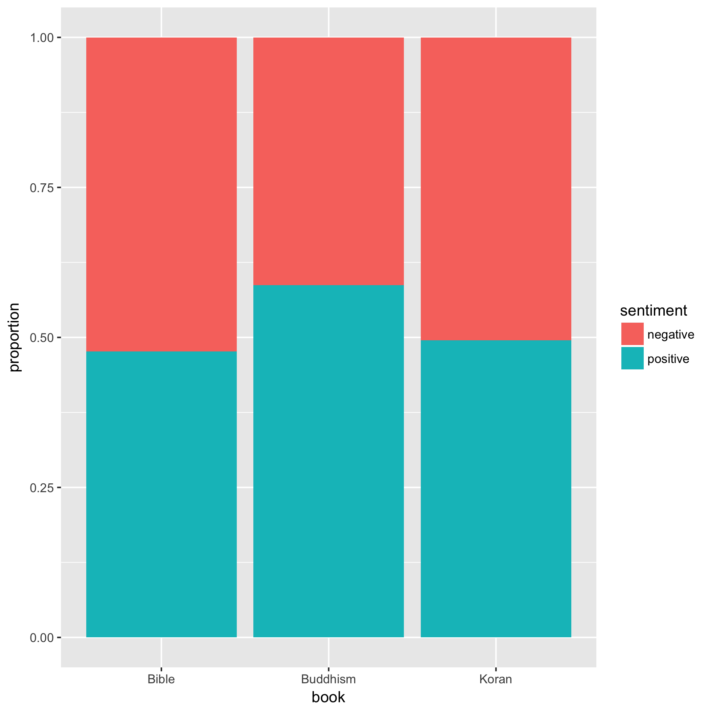
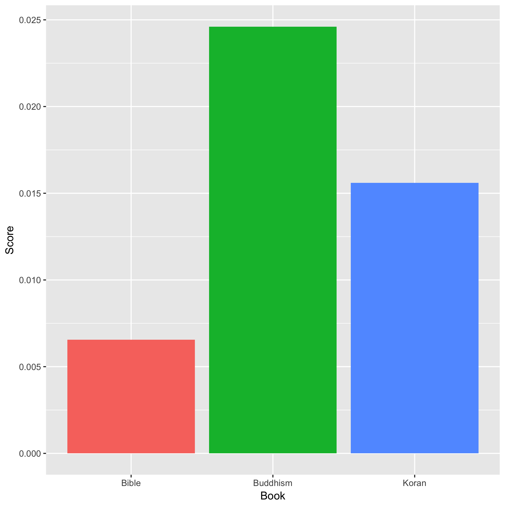
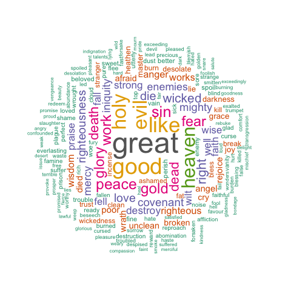
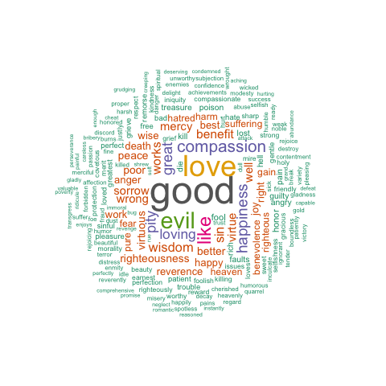
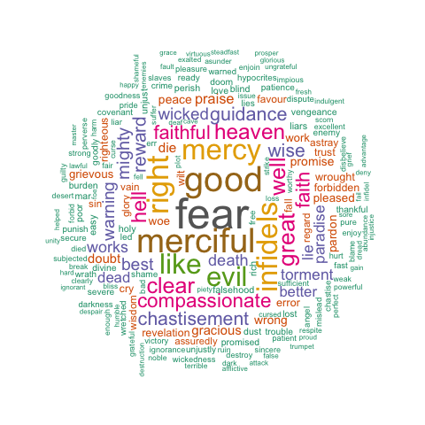

## Background
Project Gutenberg offers over 54,000 free eBooks online. Our group decided to download books that of our interest to make sentiment analysis.
My selected books are core guidance for three major religions-Christianity, Buddhism and Islam- in the world, I intend to evaluate sentiment messages conveyed in each book and make comparisons between books to see the different sentiment expressed in different religions.
Questions: What are sentiment words ditributions for each book? What are top10 positive/negative words for each book? Compare positive/negative words proportions for each book. Compare sentiment score per word for each word (The reason I do score per word rather than total score is because total score can be largely affected by the length of the books, so the score per word would be more reasonable). Combine books selected by other group members, and compare them together.

## The Data
The data was downloaded using gutenbergr package. The [gutenbergr package](https://cran.r-project.org/web/packages/gutenbergr/vignettes/intro.html) helps you download and process public domain works from the [Project Gutenberg](https://www.gutenberg.org) collection. This includes both tools for downloading books (and stripping header/footer information), and a complete dataset of Project Gutenberg metadata that can be used to find words of interest. 

## Analysis

##Sentiment words distribution for each book


From the comparisons of sentiment words distributions, we can see all of three religions mostly emphaized on postive trust words, so I think in general all these religious are trying to convey positive messages.


## Top10 positive words in each book

Bible
```{r, echo=FALSE}
table1 <- as.data.frame(Bible_t2)
names(table1) <-c("Word", "Frequency")
knitr::kable(table1)

```

Buddhism
```{r, echo=FALSE}
table2 <- as.data.frame(Buddhism_t2)
names(table2) <-c("Word", "Frequency")
knitr::kable(table2)
```

Koran
```{r, echo=FALSE}
table3 <- as.data.frame(Koran_t2)
names(table3) <-c("Word", "Frequency")
knitr::kable(table3)
```

Besides general positive words like "great","like", Bible used more "holy","heaven","peace", Buddhism focused more on "compassion", "happiness", "wisdom" and "benefit" and Koran emphaized more on "mercy" and "compassion".


# Top10 negative words in each book

Bible
```{r, echo=FALSE}
table4 <- as.data.frame(Bible_t1)
names(table4) <-c("Word", "Frequency")
knitr::kable(table4)
```

Buddhism
```{r, echo=FALSE}
table5 <- as.data.frame(Buddhism_t1)
names(table5) <-c("Word", "Frequency")
knitr::kable(table5)
```

Koran
```{r, echo=FALSE}
table6 <- as.data.frame(Koran_t1)
names(table6) <-c("Word", "Frequency")
knitr::kable(table6)
```

Three religious books all talked a lot about "evil", "sin" and "fear". Buddhism talked more about "pity" while Koran talked more about "infidels".


## Positive/negative proportions for each book



From the plot, we can see that Buddhism is the one has more proportion of positive words than negative words, whereas Bible actually used more negative words and Koran used approximately same amount of postive words to nagetive words.


##Sentiment score per word for each book


Generally, Buddhism is most positive book whereas Bible is the least.


## Combine all books in our group

```{r, echo=FALSE}
Graph4
```


```{r, echo=FALSE}
Graph5
```

Though Bible has the highest total score, but Alice's Adventures in Wonderland has highest score per word. That's because Bible is much longer.  Alice's Adventures in Wonderland is a fairy tale, it's a book for children, it actually makes sense that it conveys most positive messages among all books we selected.


##Wordcloud 
WorldCloud shows most common words in each book in an enjoyable visualization 

Bible WordCloud



Buddhism WordCloud



Koran WordCloud




