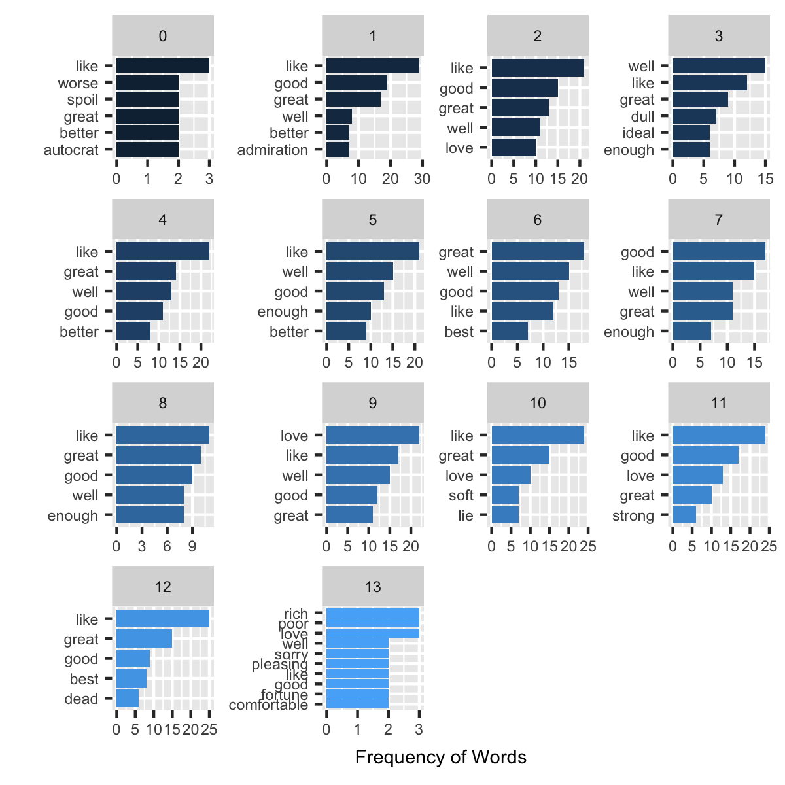
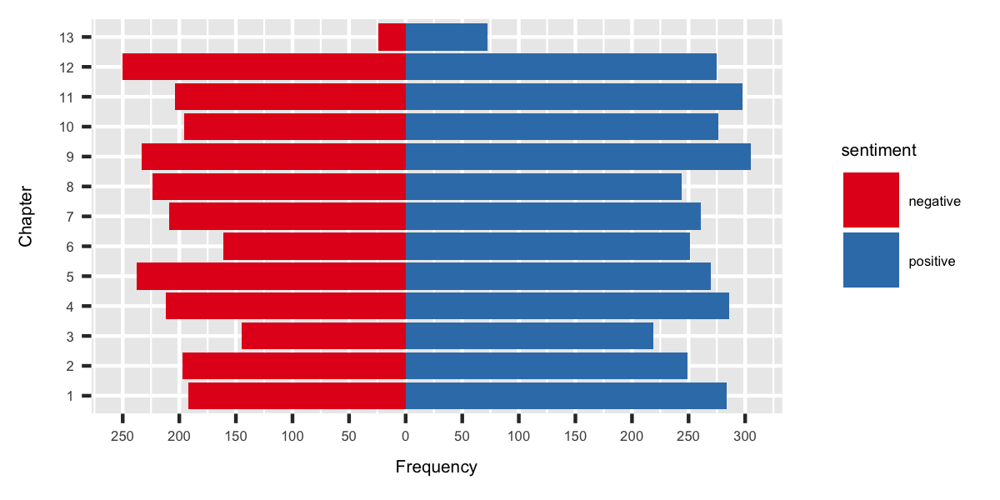
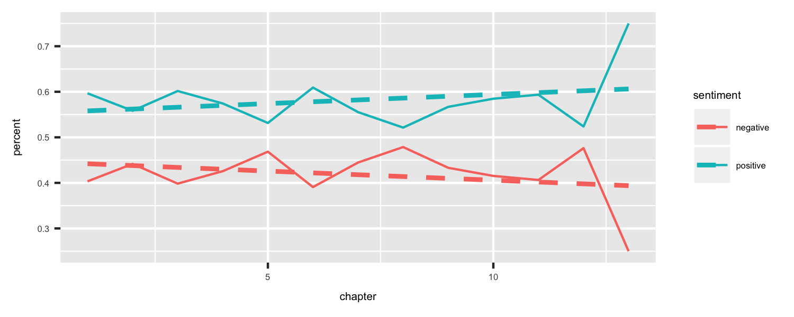
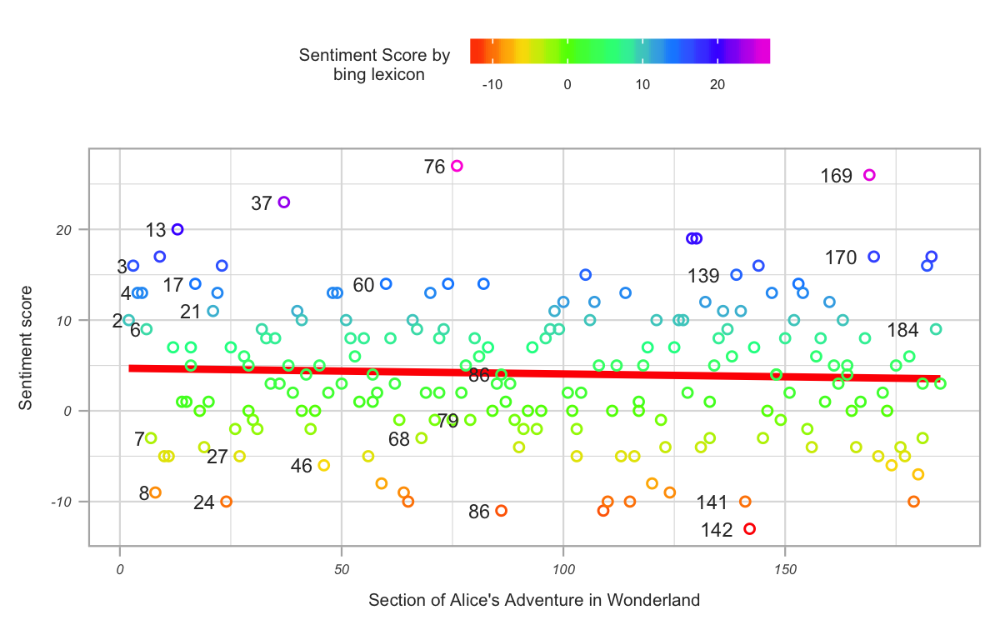

```{r, out.width = "300px", fig.align='center', echo=FALSE}

```


#My textual data: 
-Alice's adventure in wonderland is a fantasy novel written by Lewis Carroll, narrating the story of little "Alice" who fells through the rabbit hole into a fantasy world. The main character's in this book includes alice; her sister, the only character with whom alice interacts outside of wonderland; the white rabbit who leads alice to the wonderland; and king and queen of hearts who are the ruler in  wonderland. 

-This book has total 13 chapters and I am trying to analyze the overall tone of this book and how that changes as alice expererienced different adventures in her wonderland! 

-Finally, I will compare this book with the books of my other team members to see the sentiments in different genre books. 


## The Books

Books for our team's analysis was obtained from project Gutenberg collection <http://www.gutenberg.org/>. More detailed information can be found  here: [Data Download](data_download_SS.html). The book id's used to download the data was:

```
bookID <- c(751,174, 2800, 10, 18223)
# 751: Alice's Adventure in Wonderland (I will analyze this book)
# 174: Picture of Dorian Gray (Cat will analyze this book)
# 2800: Quran (Ze will analyze this books)
# 10: Bible (Ze will analyze this books)
# 18223: The Essence of Buddhism (Ze will analyze this books)
```

#Questions to answer: 
1. What are the most common positive and negative words that are used in the book?
This book was published in 1865, may be at that time words used in english literature was different than the modern literature. This question will help to find out any difference

2. What is the overall emotion/sentiment of this book and how does the negative and positive sentiments changes throughout the chapters? 
This will give anyone who have not read the book an idea of what was going on in the book, how did the book start and end

3. What is the total proportion of positive and negative sentiments


## Most frequent words of each chapter
Below is a representation of the top 5 words of each chapter in the Alice's adventure in wonderland:

<center>  

 

</center>


I donot see any fancy words in these graphs where we see the common sentiment words by chapter. Perhaps, a wordcloud will better visualize the frequent words in the book. The Wordcloud here will be an image composed of words used in the book, in which the size of each word will indicate its frequency. 

<center>  

 

</center>

From the wordcloud, we can see that the prominent words of this book are like, good, better, best, love, poor, death, etc.

Although wordcloud showed the common words but we could not clearly identify the positive and negative ones. So, it might be a good idea to look at the positive and negative words (I have used bing lexicon for this).


#Top 10 positive and negative words in the book?

The table below shows the top 10 positive  and negative words in the book

```{r, warning=FALSE, echo=FALSE, message=FALSE}
load("data_SS/data_bing.Rda")
library(dplyr)

positive <- data_bing %>% filter (gutenberg_id == 751, chapter >0) %>% count(word, sentiment) %>% arrange(desc(n)) %>% filter(sentiment == "positive") %>% top_n(10)

negative <- data_bing %>% filter (gutenberg_id == 751, chapter >0) %>% count(word, sentiment) %>% arrange(desc(n)) %>% filter(sentiment == "negative") %>% top_n(10) 


table1 <- as.data.frame(positive)
names(table1) <-c("Word", "sentiment", "Frequency")
knitr::kable(table1)

table2 <- as.data.frame(negative)
names(table2) <-c("Word","sentiment", "Frequency")
knitr::kable(table2)
```

In the top 10 negative words, there are 3 words related to death (die, dead, death). Most probably, alice or other characters got scared of dying during her exploration in the Wonderland and in fact, we see the word "afraid"" in the top 10.


#Distribution of positive and negative emotions by each chapter
This figure is showing frequency distribution of total positive and negative words in each chapter. This graph will help to reveal the overall tone of each chapter. 


<center>



</center>


From this figure, we can see that chapter 13 is the smallest one. Overall, positive sentiments outweight the negatives in most of the chapters.


#What percents of positive and negative words each chapters have?
Although the frequency distribution gives idea about the mood of each chapter it might be influenced by the total words in each chapter. Hence, calculating the percentage of emotion words by the length of chapter will give a better impression of the chapters 

The table below is showing us the top 5 chapters that have the highest percentage of positive words
```{r, warning=FALSE, echo=FALSE, message=FALSE} 
alice_bing_total<-data_bing %>% filter (gutenberg_id == 751, chapter >0) %>% group_by(chapter, sentiment) %>% mutate(sentiment_words=n()) %>% distinct(chapter, .keep_all=TRUE) %>% select("chapter", "sentiment", "sentiment_words") # creating a column for total positive and negative words

alice_bing_percent<- alice_bing_total %>% #creating a data frame that contains the percent of positive and negative sentiments over the total sentiments
    group_by(chapter) %>%
    mutate(total_words = sum(sentiment_words),
         percent = sentiment_words/total_words) 

#What percent of positive words each chapters have?
per_pos<-alice_bing_percent %>%
    filter(sentiment == "positive") %>%
    arrange(desc(percent)) %>%
    filter(percent > 0.59)

table3 <- as.data.frame(per_pos)
names(table3) <-c("Chapter", "sentiment", "Sentiment_words", "Total_words", "percent")
knitr::kable(table3)
```

The most positive chapters is chapter 13 with 75% of its sentiment words being positive. Other top positive chapters include chapter 1, 3 and 11. That means the book started in a positive way and most probably have a happy ending. Perhaps there was some climax in the middle of the book. All the chapters have more than 50% of positive sentiments supporting the frequency distribution graph.


#What percent of negative words each chapters have?
The table below is showing us the top 5 chapters that have the highest percentage of negative words 
 
```{r, warning=FALSE, echo=FALSE, message=FALSE} 
per_neg <- alice_bing_percent %>%
    filter(sentiment == "negative") %>%
    arrange(desc(percent)) %>%
    filter(percent > 0.44)

table4 <- as.data.frame(per_neg)
names(table4) <-c("Chapter", "sentiment", "Sentiment_words", "Total_words", "percent")
knitr::kable(table4)
```

From chapter 5 through chapter 8 most probably some conflicts/adventure is happening in the Alice's Wonderland.Chapter 13 have the lowest percent of negative words referring to a preferable happy ending.


#Change of Sentiments throughout the chapter
Plotting the percent of positive and negative sentiments by chapter will give us a better idea of the course of emotions in the book.

<center>

 

</center>

Throughout the chapters positve emotions are increasing and negatives are decreasing and it looks like positive words had an abrupt increase at the end of the story. The mean percent of positive and negative words plotted in dashed line confirms the trend of changing emotions as it diverge toward the end.


#Section-wise Sentiments:
I have also tried to plot the sentiment throughout the sections. The sections used for this graph are made-up section where each section contains 50 lines. The sentiment score used here are calculated by subtracting total negative words from the total positive positive words in each section using the bing lexicon.

<center>



</center>

This graph shows a nice distribution of sentiment score in the sections indicating that a balanced-approach of emotional words was used by the writter while advancing the story. Since the target audience is mainly children that way childrens would not be affected by the emotion of this book too much. The average score per section seems to be around 5. Although the chapter-wise distribution showed a divergent pattern of positive and negative words, the average sentiment score per section plotted as red line in this section-wise plot shows a slight reduction in the score toward the end. 


#Comparison with other books of my team mates
Now, I can compare this book with the books choosen by my other team members. We thouhgt to compare the books by sentiment score with the afinn lexicon. Afinn provides score for each word and combining the scores for the total words of each book would be a nicer way to compare these books. However, the length of the book (total words) might influence the score. So, we thouhgt to calculate the scores per word also and that way comparison will be more fair. 


<center>

 

</center>

We can see that Bible has the highest total score and Alice's adventure in Wonderland has the highest score per word. That makes sense because Bible has the greatest amount of words and the score changed when we considered the length of each book.


#Change of sentiments throughout the sections in all 5 books
I also wanted to see the change of sentiments throught the sections in each book. Again, the sections I used here are made-up sections containing 50 lines.Sentiemnt score was calculted by subtracting negative words from positive words identified with bing lexicon. Section-wise plot will help to reveal how the book's emotion proceeded in small segments.

<center>

 

</center>

- Picure of Dorian gray has a really interesting pattern of positive words in the first-half followed by prominent negative emotions in the later-half of the book.

- Alice's Adventure in Wonderland mostly have positive sentiments that matches with my earlier analysis.

- If we have compared books of same authors or same categories, this graph might have identified a similar pattern of writing the emotional words. 