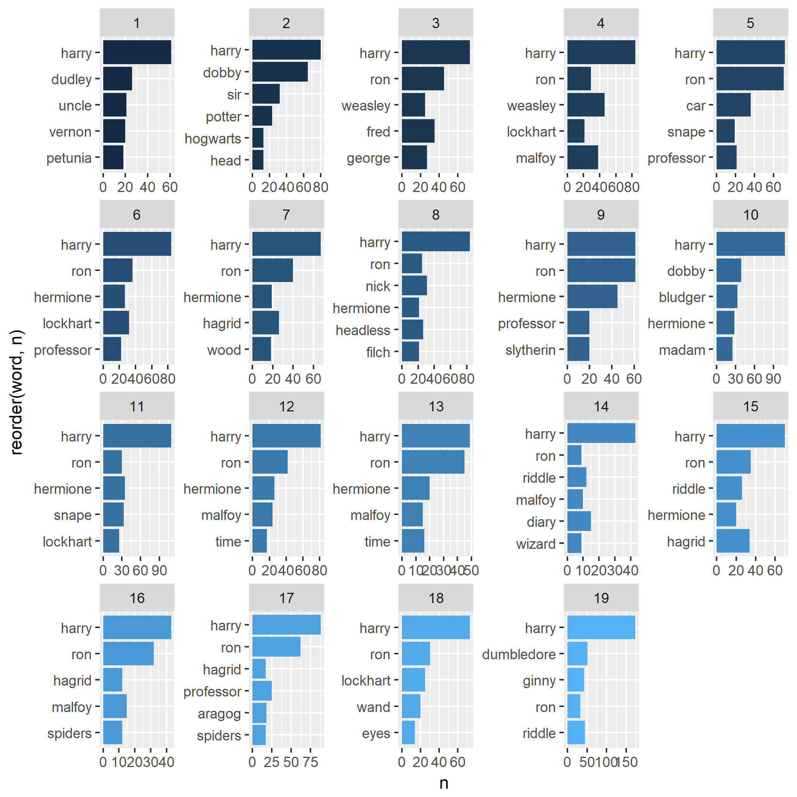
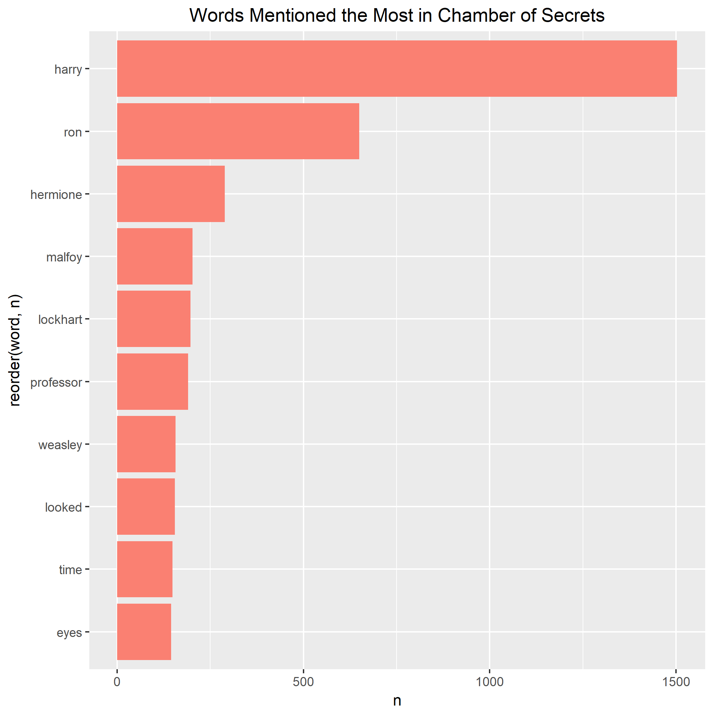
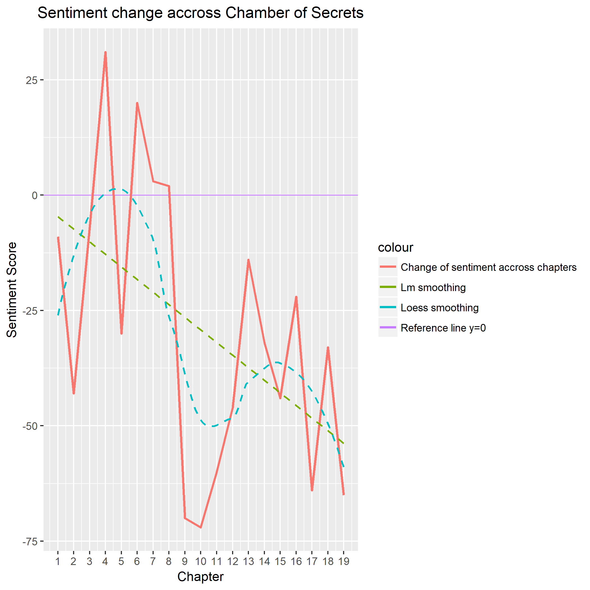
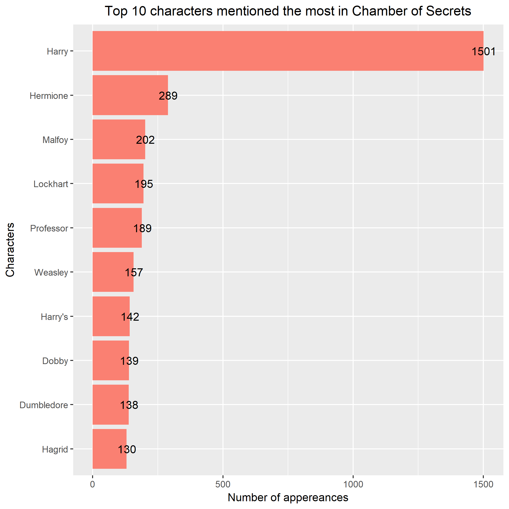
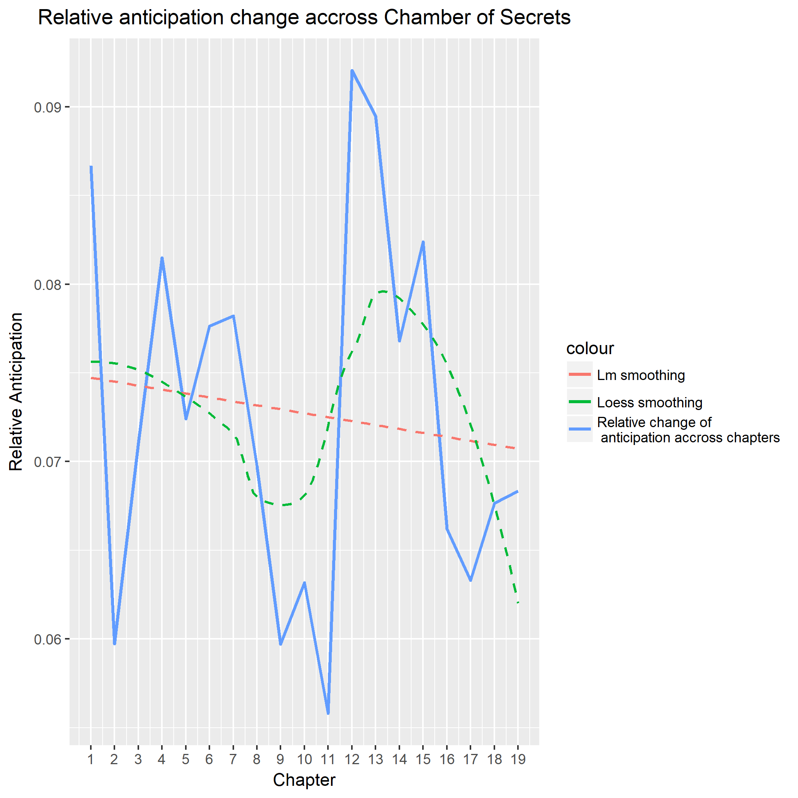
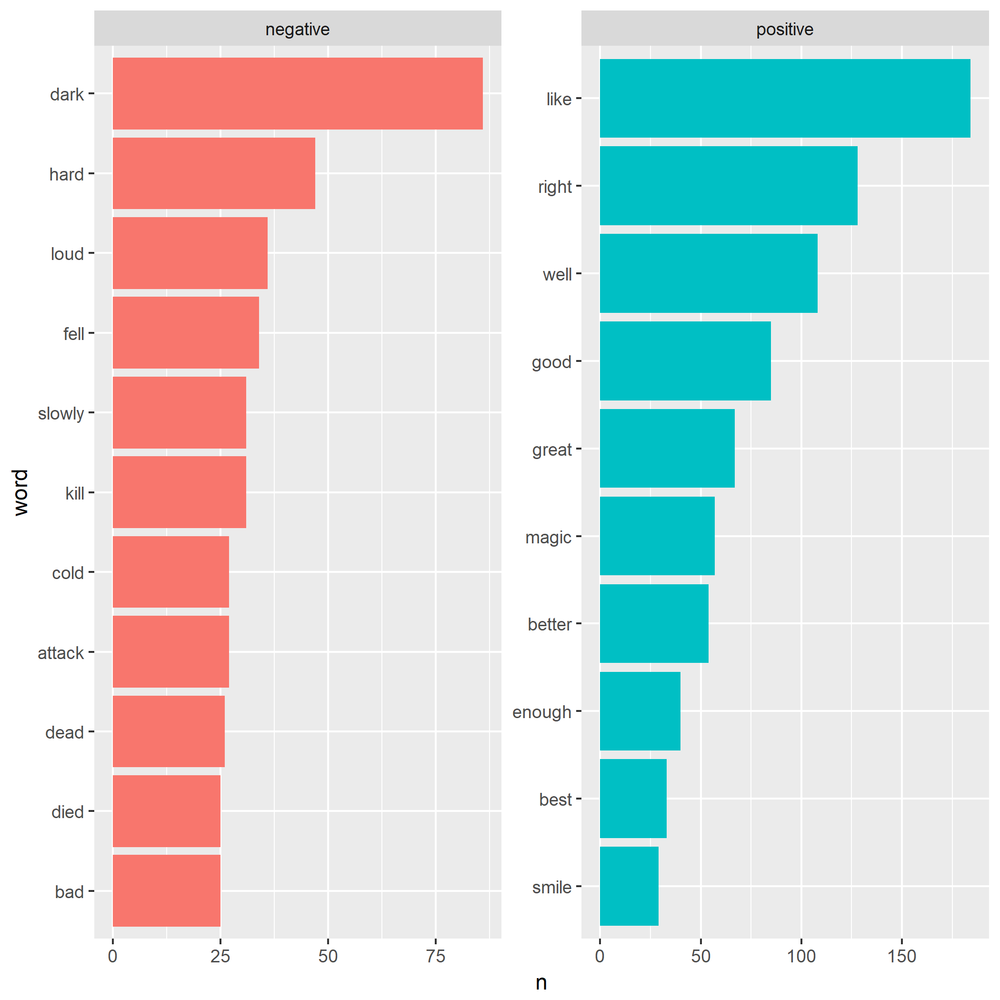
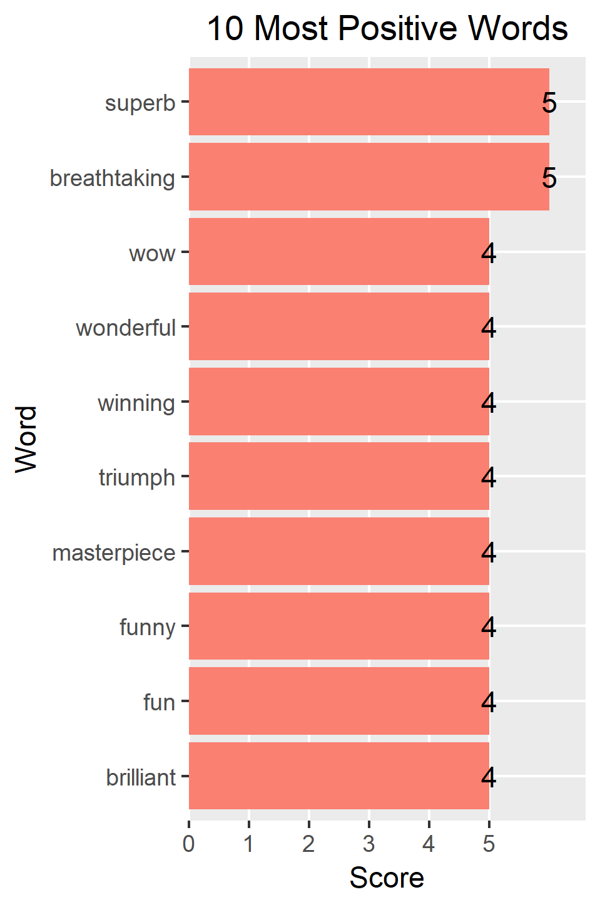
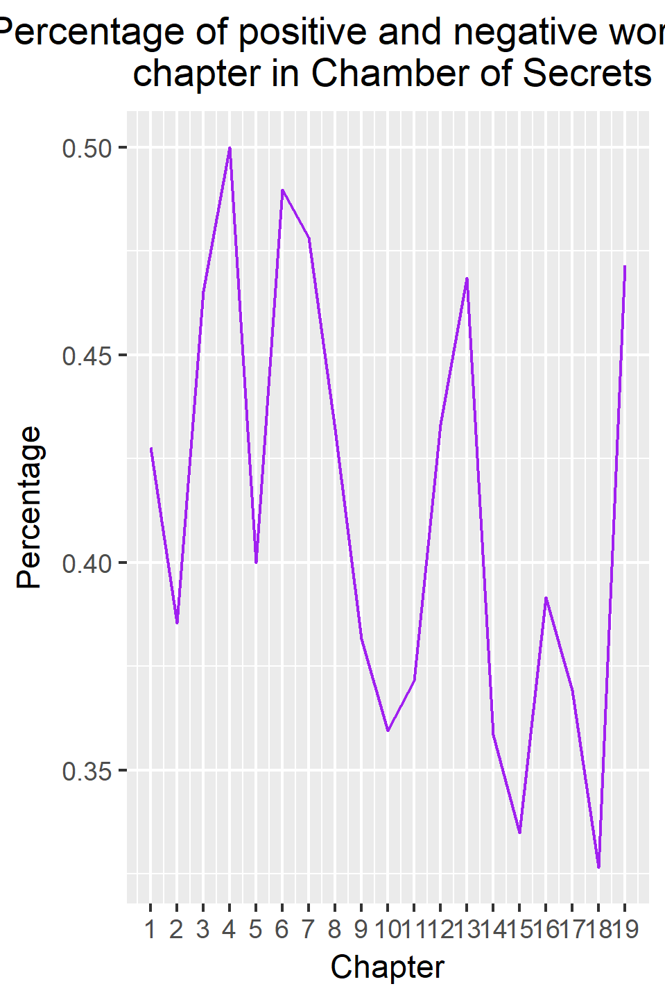
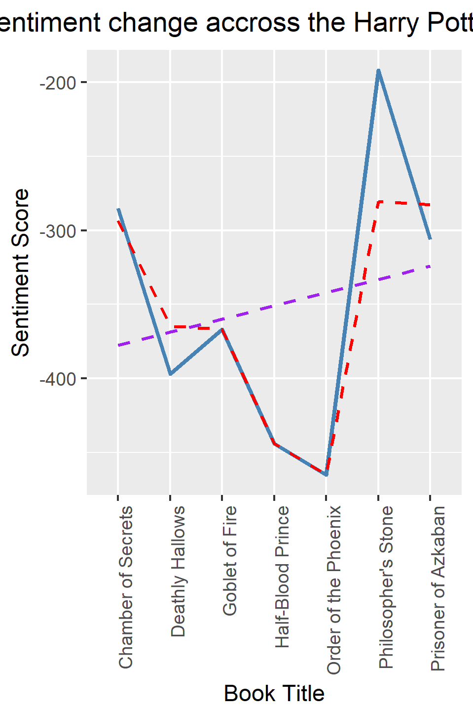

# The Data

This data comes in the package "harrypotter". It was develped by Bradley Boehmke. The data set includes full text of books 1-7 from J.K. Rowling's Harry Potter series, ready for text analysis. This includes the Philosopher's Stone (book 1), Chamber of Secrets (book 2), Prisoner of Azkaban (book 3), Goblet of Fire (book 4), Order of the Phoenix (book 5), Half-Blood Prince (book 6), and the Deathly Hallows (book 7).

# Group questions: 
## Question 1:
What are the most common words by chapter in the book "Chamber of Secrets"?

## Question 2
What are the most common words in the entire book "Chamber of Secrets"?

## Question 3: 
How does sentiment change across the entire book? *(Using afinn lexicon)*

## Question 4: 
Which 10 characters are mentioned the most?

## Question 5: 
How does the emotion "anticipation" change throughtout the book?

# Individual questions: 

## Question 1:
Which are the most common positive and negative words in the book "Chamber of Secrets"?

## Question 2: 
Which words are the most negative and positive of the book "Chamber of Secrets"?

## Question 3: 
What is the percentage of positive words for each chapter? 

## Question 4:
How does sentiment change across the entire saga? 
