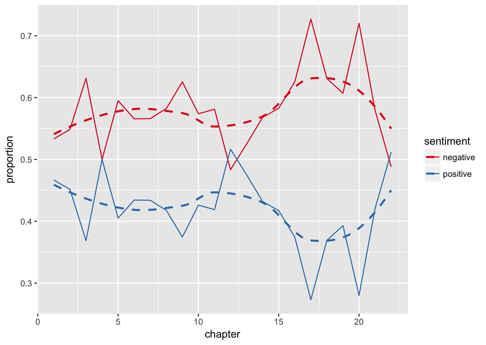
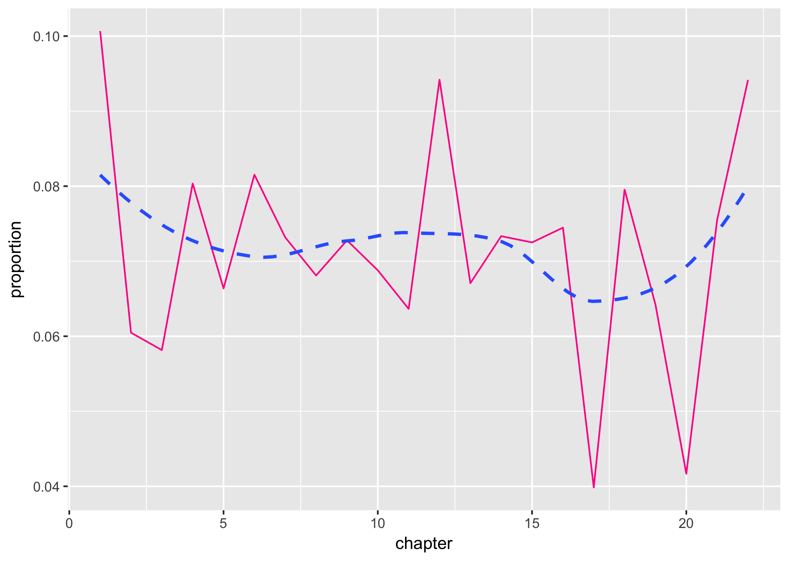
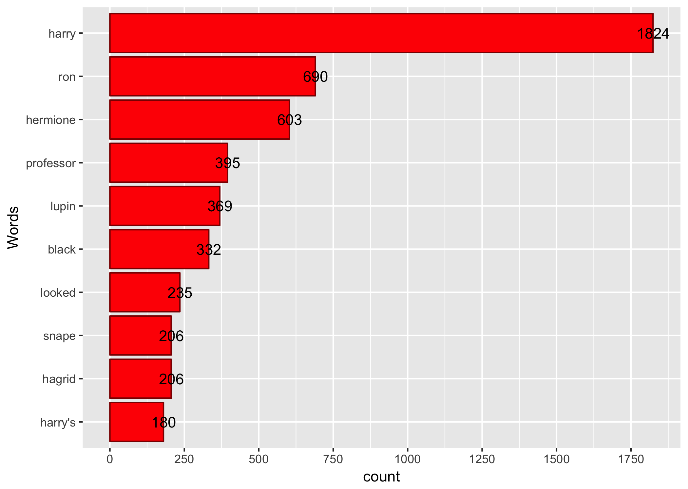
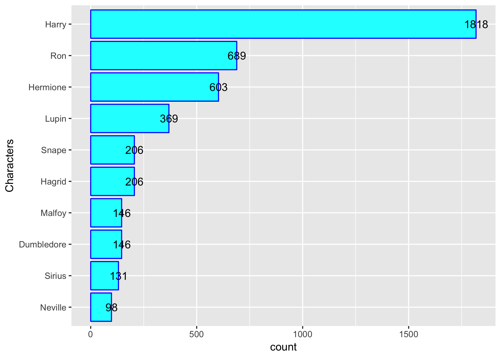
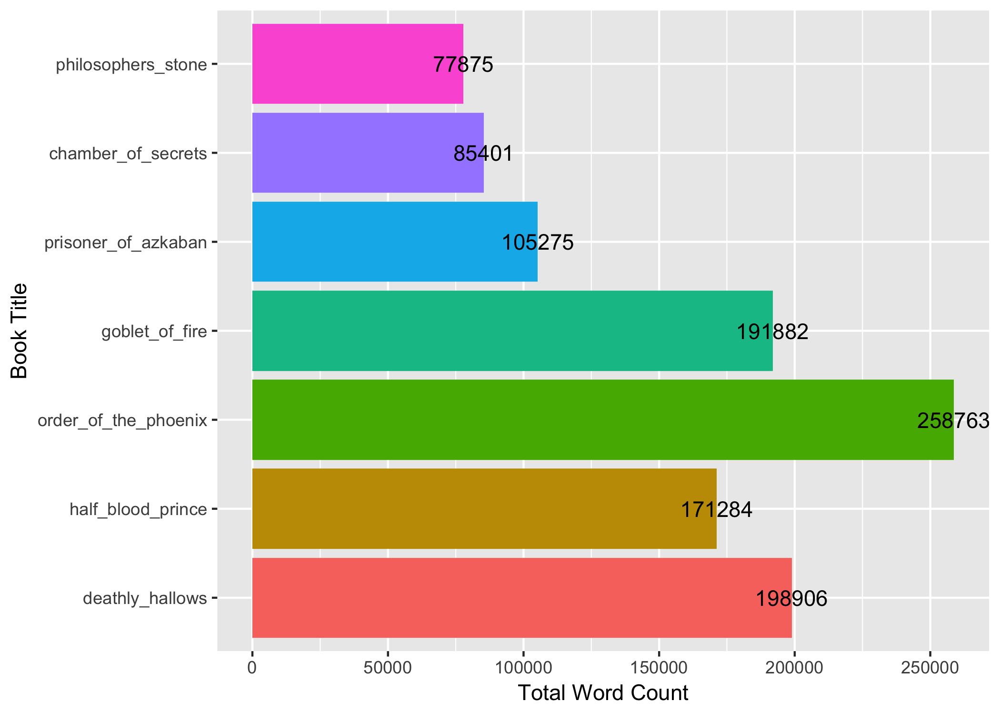
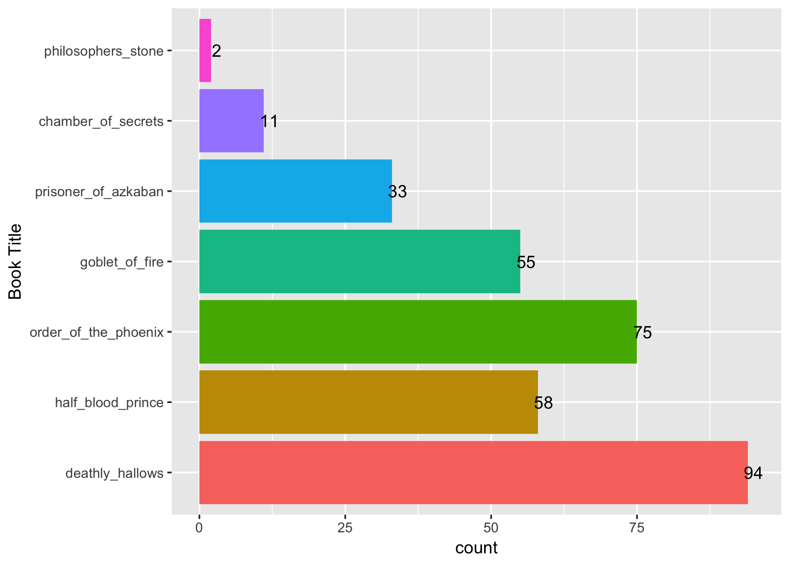

# Background 

The Harry Potter series, written by J.K. Rowling, have sold over 400 million copies worldwide as of 2017. These seven fictional novels tell the story of a young wizard's journey through wizardry school and his battle with a powerful dark wizard. This assignment aims to answer questions about this series concerning areas of word count and temporal sentiment analysis. The first step was to clean and tidy the data to setup for analysis. The second step was to implement graphs to visualize the data. Most of the data presented in this study are based specifically on the Prisoner of Azkaban book.

# The Data

This data was obtained by web scraping via the "harrypotter" package in R. More detailed information can be found here: https://github.com/bradleyboehmke/harrypotter

# The Graphs

##### Figure 1 pictured below displays the proportion of negative words and positive words throughout the chapters. The positive trend line is the inverse of the negative trend line since words per chapter were only classified as either negative or positive. Thus positive proportions are just 1 - negative proportions. From this graph, we can see that this entire book contains heavily negative words. There wasn't a single chapter where positive sentiments dominate negative. For the most part, chapters were not overwhelmingly positive nor negative.

&nbsp;
&nbsp;
&nbsp;
&nbsp;
&nbsp;

##### Figure 2 pictured below displays the proportion of anticipation in each chapter. Prisoner of Azkaban starts off with high anticipation, drops to a low anticipation near the end of the book, and finishes off with high anticipation again at the end of the book.

&nbsp;
&nbsp;
&nbsp;
&nbsp;
&nbsp;

##### Figure 3 pictured below displays the most common words throughout the entire book. Figure 3 shows that the most common words are mostly characters in the book. Figure 4 is similar to Figure 3, but shows strictly character names. Figure 4 clearly shows that Harry is clearly the main character, followed by Ron and Hermione, the two supporting characters next to the main character. There are a few names specific to the Prisoner of Azkaban such as Lupin and Sirius.

&nbsp;
&nbsp;

&nbsp;
&nbsp;
&nbsp;
&nbsp;
&nbsp;

##### Figure 5 pictured below displays the thickness of each book. The first three books in the series are notably much thinner than the later half. The Order of the Phoenix is the thickest book. Figure 6 also pictured below displays how many spells were used in each book. For the most part, the frequency of spells is proportional to the thickness of the books except for the Order of the Phoenix and Deathly Hallows. Deathly Hallows has the most spells used since this book is the final fight against the dark wizard Voldemort.

&nbsp;
&nbsp;

