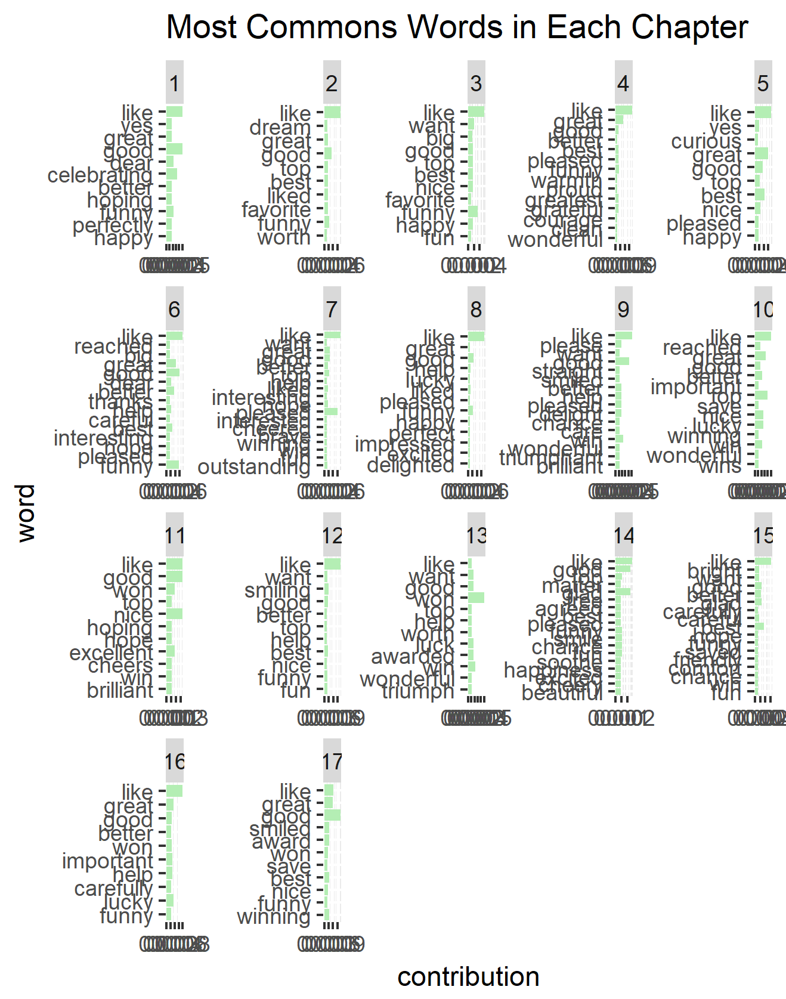

# Sentiment Analysis In the Philosopher's Stone

Harry Potter is a series of magical stories wrriten by JK Rowling , and is an international success. These books put JK Rowling on the map as a fiction author and have made her the household name she is today. This analysis seeks to explore aspects of her writing style, word choice, and how she manipulates the reader's emotions throughout the book. We explore how she varies her technique from chapter to chapter , and we take a specific look into chapters themselves.

### Question 1 :Sentiment Content In Philosopher's Stone
I want to first start by looking at the sentiment content in the very first book that she wrote : Philosophers stone

### Question 1b : Using Affin Lexicon For more perspective
I can also use a different lexicon that assigns a score rather than saying positive and negative. Affin lexicon 

It can be seen here that JK rowling changes the sentiment's of her chapters quickly. This would make sense, seeing as the books are known for being emotion inducing. It can be seen that from the onset, JK rowling's language quickly becomes negative as she sets up the books, and then works on building up positive sentiments towards the middle of the book . However, as can be seen, the sentiment takes a nose dive in chapter 15, perhaps indicating the book ends on an uncertain/ negative note.

### Question 2: Most Common Words in Book
For this part I want to see the most common words of the whole book and then the most common words by chapter.

### Question 2b : Most Common Words In Every Chapter

### Question 3 : Most Popular Characters
Next I would like to look at the most popular characters in the first harry potter book.

### Question 4 : Anticipation
For this next part I would like to see how the anticipation changes throughout the book. JK rowling is known for how she strings the reader along and how she infuses anxiety into her text. We will examine this here using the NRC lexicon 

### Question 4b: Graphing Anticipation Change
Another way of tracking anticipation would be to look at the proportion of words which have an anticipation sentiment rather than looking at the raw usage of the words 

It appears that JK rowling really takes the reader for an emotional ride  with her first book. Notice the proportion of words that have an anticipation sentiment rise and fall quite sharply from chapter to chapter.

##My Personal Analysis 
For my own personal analysis I want to look at a variety of aspects in the first harry potter book. I want to start by looking at the top 10 words in each sentiment across the entire book

### Question 5: Top 10 Words Of Each Sentiment

### Question 6 : Sentiment Contribution
I would like to see the contribution that each sentiment makes based on the afinn lexicon.

