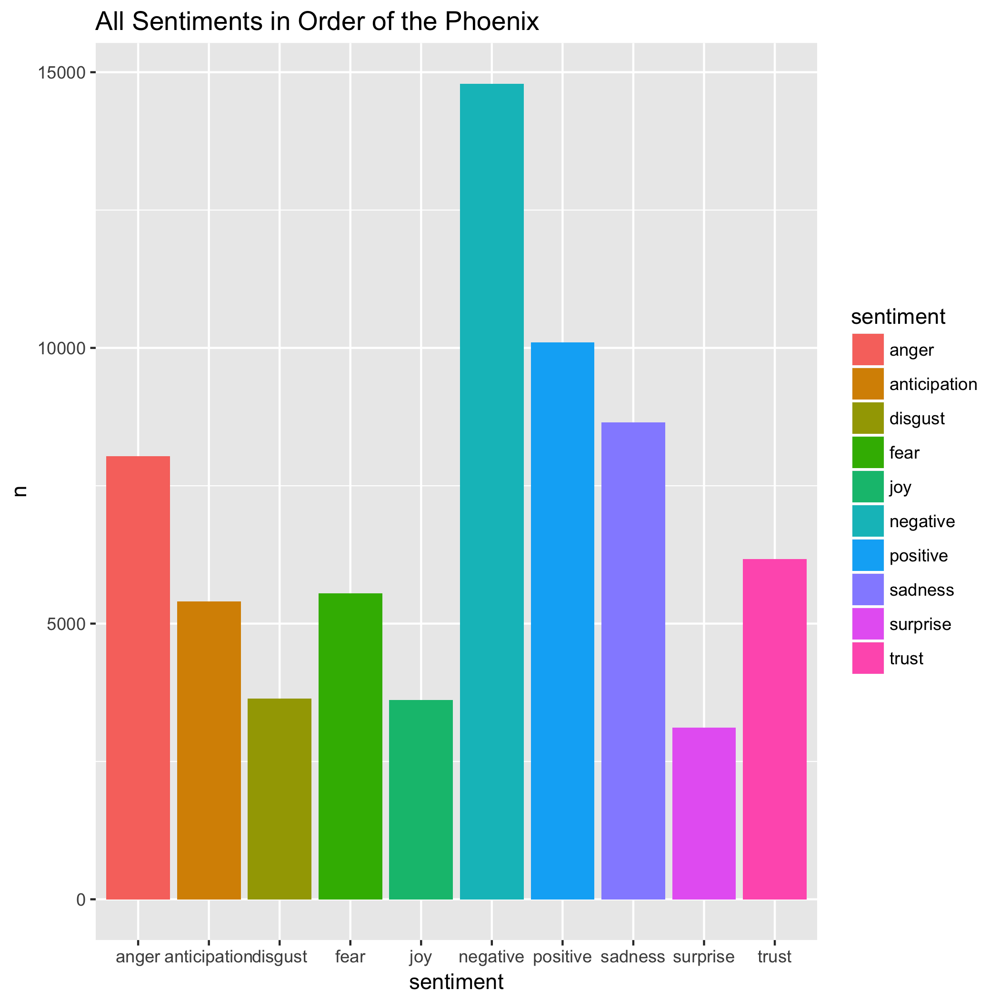

## Background 
Harry Potter is a very popular series written by J.K. Rowling.There are a total of seven books published between 1997 and 2007. The goal of this assignment was to clean and analyze the text for each of the seven books. Some of the concepts focused on include sentiment analysis, character repetition, and word count. Most of the data presented in this file is based on Harry Potter and the Order of the Phoenix.

## The Data
This data was obtained by downloading the harry potter package from the library. The data was cleaned based on the function that was created. 


## Q1:How the sentiment changes across the entire book?


## Q2:What are the most common words by chapter?


## Q3:Which characters appear the most?


## Q4:How the emotion anticipation changes throughout the book?


## Q5:What is the word count for each book?
```{r}
load("data/count_hp5.Rda")
knitr::kable(count_hp5)
```

## Q6:What are all of the sentiments in the order of the phoenix?



