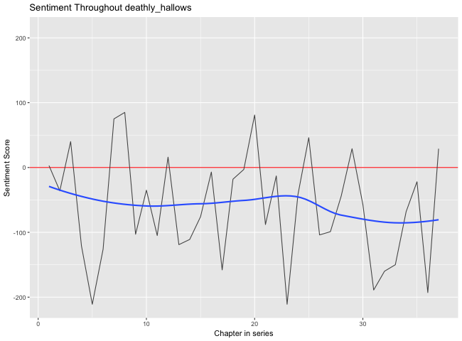
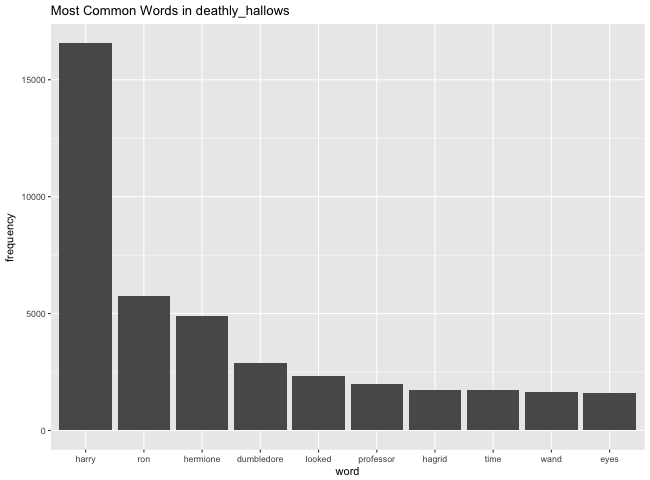
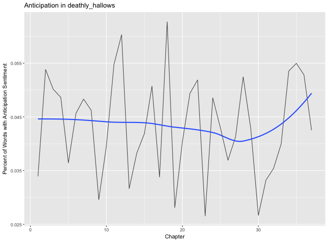
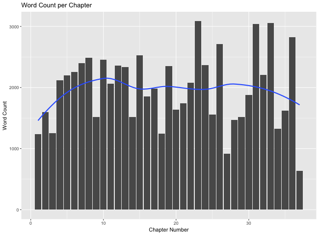
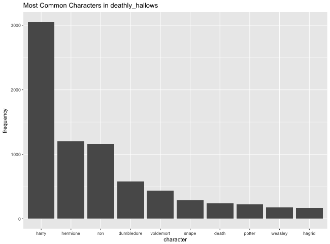
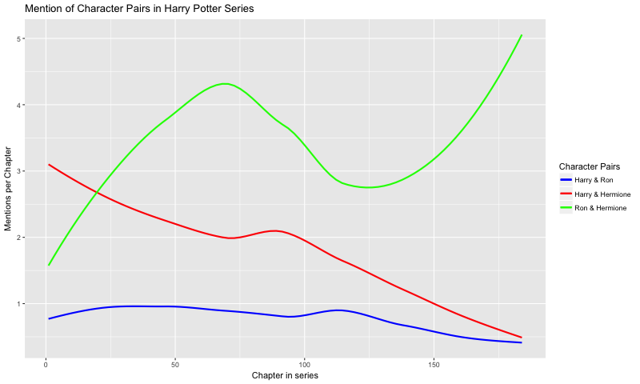

### The Data
The data were obtained from [this package](https://github.com/bradleyboehmke/harrypotter).

The book analyzed in this document is:
```
book_title <- "deathly_hallows"
```

### How does sentiment change throughout the book?

Different words can have positive or negative sentiment, and words can have different magnitudes of positive or negative sentiment. For each chapter of the book, we can calculate the overall sentiment score, where a negative score indicates an overall negative sentiment, and a positive score indicates an overall positive sentiment. Below is a plot showing how overall sentiment changes throughout the book:



### What words are used most commonly in the book?

Below is a plot that shows the most common words used in the book, excluding meaningless words (stop words).



### How does anticipation change throughout the book?

Certain words are associated with specific emotions. Here, we look at how many anticipatory words appear throughout the book. 



### How does word count change by chapter?

Below is a plot showing the number of words that comprise each chapter in the book.



### What characters appear most frequently in the book? 
Here, we can see a table of the characters that appear most frequently in the book:



### How do character relationships change throughout the series?

Certain pairs, like Harry & Ron, are mentioned at different frequencies throughout the entire series. This data could tell us about the nature of characters' relationships as the story goes on. Below is a plot that shows how frequently certain character pairs are mentioned throughout the series.

