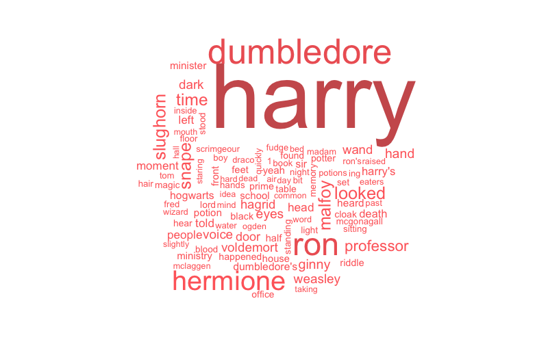
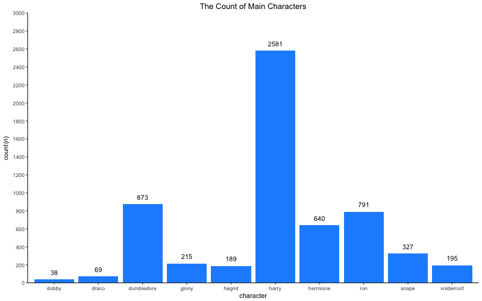
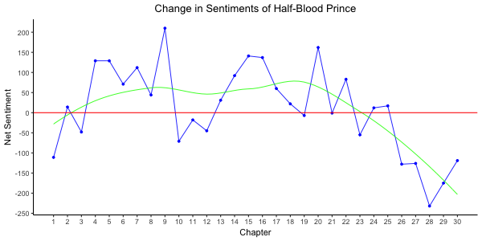
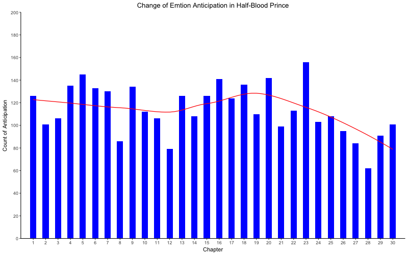
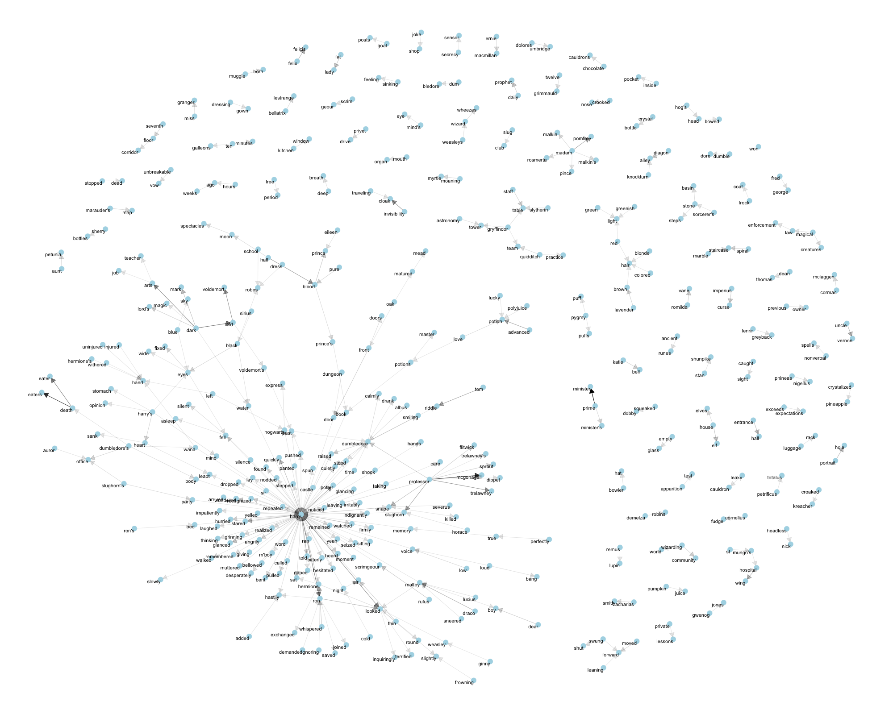
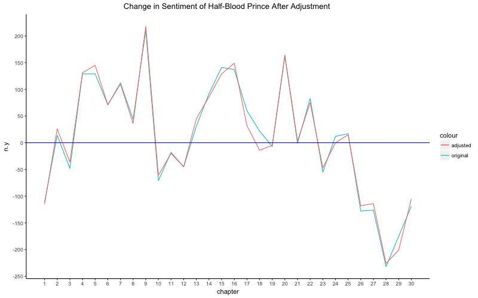

## Background 

Harry Potter is a series of fantasy novels written by British author J. K. Rowling. The novels chronicle the life of a young wizard, Harry Potter, and his friends Hermione Granger and Ron Weasley, all of whom are students at Hogwarts School of Witchcraft and Wizardry. The main story arc concerns Harry's struggle against Lord Voldemort, a dark wizard who intends to become immortal, overthrow the wizard governing body known as the Ministry of Magic, and subjugate all wizards and muggles, a reference term that means non-magical people.

This is just a simple report on some of the basic statistics for the 6th book in the series, Harry Potter and the Half-Blood Prince. The report will try to find the basic statistical fact for the text and make some further analysis. 

## The Data

The data used in this report is from the R package, Harry Potter Book Series. 


## Basic Information
1. The graph below depicts the most important 100 keywords in Harry Potter and the Half-Blood Prince. These words are selected based on their frequency of occurrences through the whole book, except for the stop words. By knowing the keywords, we can have a basic idea of the contents and the relatively important words in this book.

Since the size of the words below is decided by their frequency of occurrences, we can know the importance of a word simply by comparing the size. For example, from Fig.1, we can know that Harry, Dumbledore, Ron and Hermione are the major characters in this book. Also, for someone who did not read the book, he/she can have a basic idea that this is a book about magic and wizard. And the story should have happened around school, where professors and students are involved. The above informaion is extracted from the keywords in the graph, which is actually consistent with the book. 



2. Harry Potter and the Half-Blood Prince has a total of 171,284 words. The table below displays the most common words in each chapter, except for the stop words. By knowing that, we can have a basic idea of the important characters or items in each chapter in order to get to know the story frame. 

From the table below, it is very clear that Harry and Dumbledore should be the main characters in this book. And the data here is consistent with the facts in the book that Dumbledore leads Harry to find the seven horcrux that Voldemort hided in the book.
```{r, echo=FALSE}
load("data/modifieddata/HP6Top.Rda")
knitr::kable(Book6Word, align="c")
```

3. There are many characters in this book. And the graph below depicts the main characters and their frequencies. Fig.2 not only shows Harry is the main character, but also tells that Dumbledore, Ron, Hermione and Snape are also important characters. The data is consistent with the book because Ron and Hermione are the best friends of Harry, and Dumbledore and Snape both protect Harry in this book. So their frequency of occurences should be the highest. 




## Further Analysis
4. The graph below depicts the sentiment changes along the chapter in this book. From the graph, we can see that there is a clear difference in net sentiments among different chapters. The sentiment becomes more positive from chapter 1 to 10. Then it becomes negative from chapters 10 to 15. Then the sentiment becomes positive again from chapter 15 to 22. The it becomes more and more negative from chapter 22 to the end. 

The data here is consistent with the book. In this book, Dumbledore told Harry the secrets of horcrux and was then killed by Snape in the end. So the ending part is sad and dark. For Harry and the other students in school, the future is unknown because of Dumbledore's death and it seems like that the evil power will win. So the value of net sentiment becomes more and more negative in the end. 



5. Among all the emotions, we can try to analyze the change of one specific emotion "anticipation".
The graph below tells that the anticipation increases until Chapter 19. From Chapter 19 to the end, the "anticipation" emotion decreases, which is in consistent with the contents in the book as we discussed in the previous question. 




6. To make further analysis, we can try to examine bigrams in this book. After cleaning the data, the following table gives the most popular bigrams in each chapter. From the table, we can see the most important keywords in every chapter in order to know the story outline. By knowing the most frequent bigrams in every chapter, we can have a idea of what the chapter is about. For example, Chapter 30 is about Dumbledore's funeral and everyone was very sad. So "Dumbledore's body" was mentioned for 6 times in that chapter. As a result, the table below is a good indicator that could tell us who or what is the main theme in that chapter. 

```{r, echo=FALSE}
load("data/modifieddata/HP6topbi.Rda")
knitr::kable(Book6TopBi, align="c")
```

7. We can then examine the relationship between words by selecting the most frequent bigrams through the whole book and visualize these relationships. 

From the graph below, we can see that Harry is the word that has the most number of connections with other words in this book, which could indicate his role as the main character. We can also analyze other interesting connections from the graph. For instance, the graph shows that Harry is directly connected with Voldemort and Dumbledore. Enlarging the picture, it is interesting to find that Dumbledore is also directly connected to the words "past" and "Hogwarts". And these two words are directly connected with Voldemort. Then we can know that Dumbledore should have connection with Voldemort's past time in Hogwarts, which is in consistent with the contents in the book. 




## Discussion
8. We analyzed the sentiment change in Question 4, but there are some errors in that estimation. So I will talk about the shortcomings of the previous answer and try to give a more precise answer. 

In the answer about, words are considered separately. As a result, "Not Like" would be considered as a positive word instead of a negative one. So the answer below is trying to eliminate such bias. So I used bigrams in this case, and substrate the "not" words to have a more precise evaluation. The details of this method are stated in the comments in R file. 



