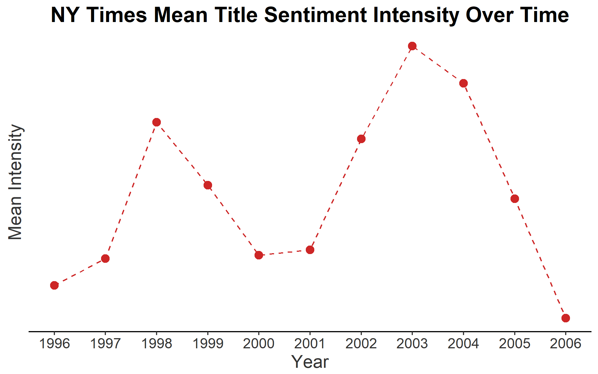

```{r setup, include=FALSE}
knitr::opts_chunk$set(echo = TRUE)
```

#Sentiments of NY Times Titles

## Intensity of Negative and Positive Words in NY Times Titles

This section looks at what the frequency distribution of the intensity of negative and positive words used in the NY Times titles are. 


This plot shows the frequency of the mean intensities of positive/negative words used in the titles. A higher absolute value indicates greater intensity of an emotion in words for the title, whereas a lower one indicates less intensity. Negative numbers indicate negative emotions whereas positive numbers indicate positive emotions. 

From this plot, it looks like most of the titles tend to have a negative sentiment. Less of the titles tend to be in the extremes of both types of emotions and in neutral sentiment. 

## Absolute Intensity of Words Used in NY Times Titles

This section looks at just how intense the emotions of the words in NY Times titles are (i.e., it doesn't matter whether the emotions are negative or positive; we are just interested in how extreme these emotions get).


Here, it looks like most of the titles do not have an extreme intensity in their sentiment. Rather, they tend to be in the mid to lower range in terms of their sentiment intensity. 

# Sentiment and Intensity Over Time

How is does the sentiment of the title differ over time?


It looks like sentiment tends to decrease until 1998. From 1998 to 2000, sentiment scores increase (i.e., tend to be more positive) but starts decreasing again starting at year 2001. From 2001 to 2003, titles tend to be more negative but they start becoming positive moving forward. 



Now we can look at just the absolute intensity of the sentiment (regardless of whether the words are positive or negative). 

Here, we see that the emotional intensity of the titles increases from 1996 to 1998. They decrease until around 2000/2001. Starting from 2001 to 2003, the intensity of the sentiment increases, but they decrease starting from 2003 to 2006. However, it is worth noting that the actual intensity remains lower, indicating that the sentiment intensity of the titles in NY Times do not tend to be high over time. 

# Conclusion

In conclusion, we see that sentiment and intensity of emotional words in NY Time title articles are generally not extremely intense. Furthermore, we see that while there is variability in changes over time of the mean sentiment and intensity, we generally do not see any intense changes in sentiment and emotional intensity. 
