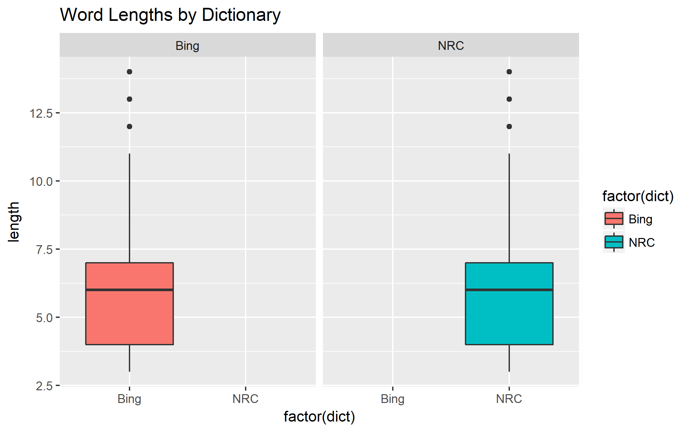

```{r setup, include=FALSE}
knitr::opts_chunk$set(echo = TRUE)
options(digits=3)
source("brian_analysis.R")
```

## Comparing NRC and Bing

Let's examine matches in the text for each of the NRC and Bing sentiment dictionaries dictionary. Note that the following analyses count the same word multiple times if it appears in multiple headlines, which makes sense if we want to see how the dictionaries are interacting with our specific dataset.

First, we see that NRC yields `r num.nrc` matches while Bing yields `r num.bing`.

The NRC dictionary has significantly more matches in the NYTimes data set. How do the words matched by each dataset compare with respect to length?



The distributions appear identical.

Again note that the two dictionaries provide different information corresponding to each word: NRC gives multiple specific sentiments along with a positive/negative characterization, while Bing gives just a binary positive/negative characterization. We may investigate whether these two dictionaries give consistent information by restricting NRC's responses to positive/negative and looking at words that match both dictionaries.

Analysis shows that the two dictionaries' sentiments agree `r agreement*100` percent of the time, but not always. Where do they differ?

```{r, echo=F}
compare %>% filter(sentiment.bing != sentiment.nrc) %>% 
  select(word, sentiment.bing, sentiment.nrc) %>% 
  group_by(word) %>%
  mutate("Occurences" = n()) %>%
  slice(1) %>%
  ungroup()
```

Interestingly, where the dictionaries differ, Bing seems more likely to return "positive."

Apparently, the most important discrepancy in this dataset is the word "tough." Let's look at the headlines that contain the word "tough."

```{r, echo=F}
ids = bing.sents %>% 
  filter(word == "tough") %>%
  select(Article_ID) 
NYTimes %>%
  filter(Article_ID %in% unlist(ids)) %>%
  select(Title)
```

These instances appear to be rather evenly split between cases that could be deemed "positive" (tough = strong) or "negative" (tough = difficult).

## Logistic Model for Topic

The NYTimes dataset comes along with a "Topic Code" (one of 27 numbers) assigned to each headline. Unfortunately, we have been unable to identify what real life topics these topic codes correspond to.

As an example, let's look at some headlines with topic code 5.

```{r, echo=F}
NYTimes %>% 
  filter(Topic.Code==5) %>%
  select(Title) %>%
  sample_frac(.1)
```

Apparently topic 5 is about labor. One more example, Topic 12:

```{r, echo=F}
NYTimes %>% 
  filter(Topic.Code==12) %>%
  select(Title) %>%
  sample_frac(.06)
```

Topic 12 seems to be crime.

We will attempt to build a logistic multinomial classifier for the topic code. This might be more useful if we knew what all the topics were, but it can still be interesting.

We need to decide what words we are going to use to build the model. If we use too many words we could overfit the data, and if we use too little we could underfit it. I will use the top 30 most common words. (Greater than 30 yielded computational issues. Also, it is possible that it may be occasionally beneficial to use less common words to discriminate among topics, but intuitively it seems useful to use words that occur many times.) The first task is to find the fifty most common words. We start with the unnested "words" data set. I have displayed them below.

```{r, echo=F}
df = data.frame("30 most common words" = model.words)
df
```

Now after creating a feature column of each row that gives the number of times each word appears in the headline, we fit a multinomial logistic classifier, and check how it does on the training set.

Now we train the multinomial logistic classifier, and check its performance on the training set, which yields a `r accuracy*100` percent success rate.

Keeping in mind this is still a training set, not a test set, this sounds promising, considering there are 27 topics to choose from and the model. However, things change when we look at what the predictions actually are:

```{r, echo=F}
table(predict(model, newdata = model.data))
```

The model nearly always predicts topic 19, which is the most common topic in the data set, so it is basically useless. This indicates we need a more sophisticated way of measuring accuracy, and a more sophisticated way of estimating the model parameters, if not an entirely new model. These questions are beyond the scope of the current project.