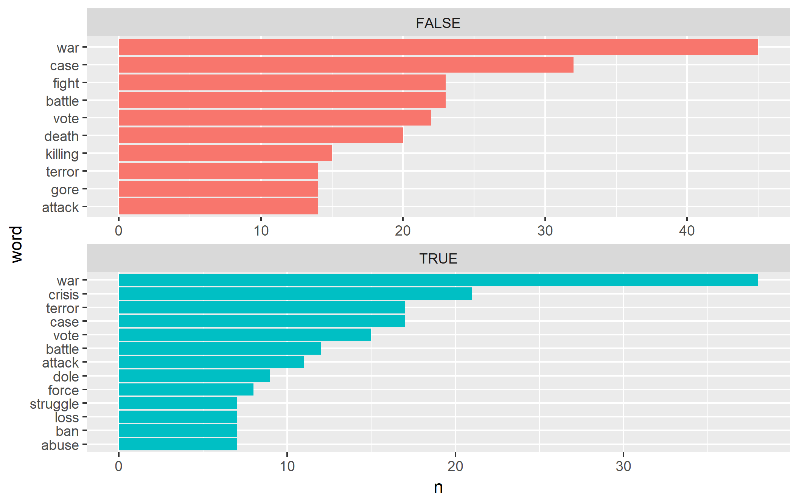
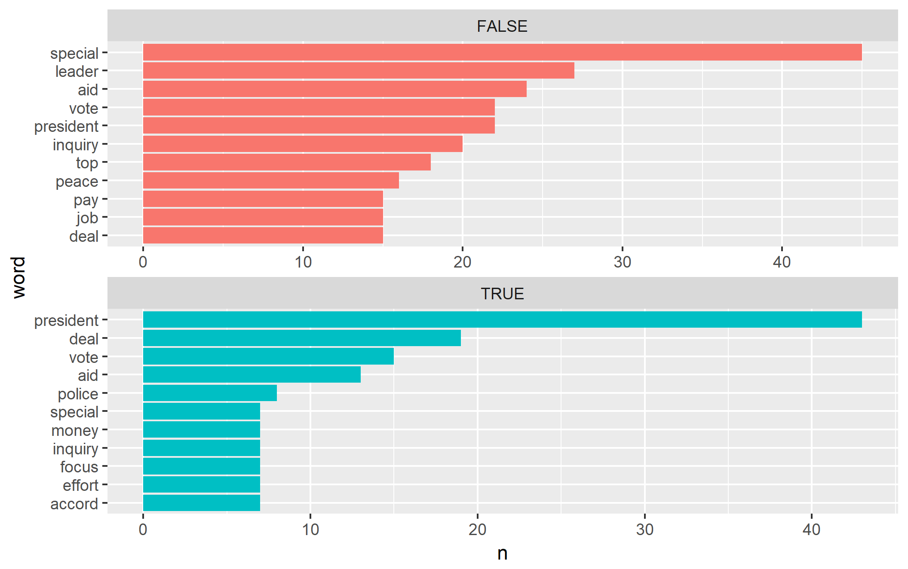
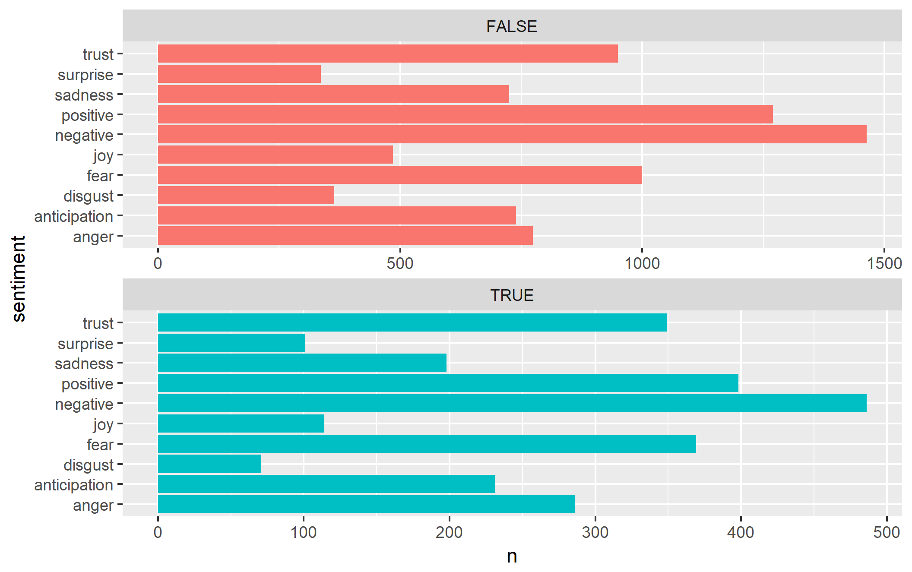

```{r setup, include=FALSE}
knitr::opts_chunk$set(echo = FALSE)
```

##Question: Does the proportion of positive and negative words differ according to whether or not the headline is in all caps?

###Answer: Let's see:
I will use the NYTimes dataset of headlines to calculate the proportion of negative and positive words for each capitalization scheme. Then I will run chi-squared tests to determine whether there is a statistically significant difference in those proportions. I will interpret those results and then create a few visualizations to further explore the sentiment differences between all caps and not all caps headlines.

### Difference in proportion of negative sentiment words: Chi-Squared Test 

**Ho: All caps and not all caps titles have equal proportions of words with negative sentiments.**

**Ha: All caps and not all caps titles do *not* have equal proportions of words with negative sentiments.**

```{r, echo=FALSE}
load("olivia_results/negative.Rda")
neg_results
```
> Note:
> "prop 1"" is the proportion of negative words in normally capitalized titles and "prop 2"" is the proportion of negative words in all caps titles.

**Conclusion: **
Based on our small p-value, I reject the null hypothesis and conclude that there *is* statistically significant evidence of a difference in the proportion of positive words between all-caps and not all-caps headlines. Specifically, all-caps headlines appear to have a smaller proportion of negative words.


### Difference in proportion of positive sentiment words: Chi-Squared Test 

**Ho: All caps and not all caps titles have equal proportions of words with positive sentiments.**

**Ha: All caps and not all caps titles do *not* have equal proportions of words with positive sentiments.**
```{r, echo=FALSE}
load("olivia_results/positive.Rda")
pos_results
```
> Note:
> "prop 1"" is the proportion of positive words in normally capitalized titles and "prop 2"" is the proportion of positive words in all caps titles.

**Conclusion:** 
Based on our small p-value, I reject the null hypothesis and conclude that there *is* statistically significant evidence of a difference in the proportion of positive words between all-caps and not all-caps titles. Specifically, all-caps titles appear to have a smaller proportion of positive words.

### Interpreting Results Together
Based on these two tests, it appears that all-caps headlines actually have a lower proportion of both positive and negative words. This may be because they have more filler words, or more words that are unrecognized by the nrc sentiment library. Or, it could actually be because they are less "sentimental" headlines.

# Visualizations
I will now create some visualizations to look at a few of the differences between caps and all caps headlines

### Top 10 Negative words for not all-caps and all-caps headlines


The top negative words appear to be pretty similar across all-caps versus normally capitalized headlines. Interestingly, "crisis" does not appear in the normally capitalized top 10 at all, but does appear in the all caps top 10. Perhaps all caps are used more for ~urgent situations~?

Note: the all-caps headlines have several words tied for 10th place, so more than 10 words are displayed on this plot.

### Top 10 Positive words for not all-caps and all-caps headlines


The top positive words show a little more variation across capitalization schemes. It is interesting that "president" is treated as a positive word, as this is by far the most frequent positive word in the all-caps data. I wonder if an analysis in which president was removed from the positive words would show an even *stronger* difference than what we've already seen (that all caps titles have fewer positive words).

### Top 10 Sentiments for not all-caps and all-caps headlines:



These plots allow us to actually compare the breakdown of sentiment distribution across not caps and all caps headlines.

The most notable differences appear to be that all caps headlines have a visibly higher proportion of fear words and anger words, while not-caps headlines have a visibly higher proportion of sadness, disgust, and joy. To me, this implies that all caps headlines may be used for more specific scenarios (i.e. crisis-related ones that would relate to fear/anger) while not-caps headlines probably encompass a wide range of scenarios.

