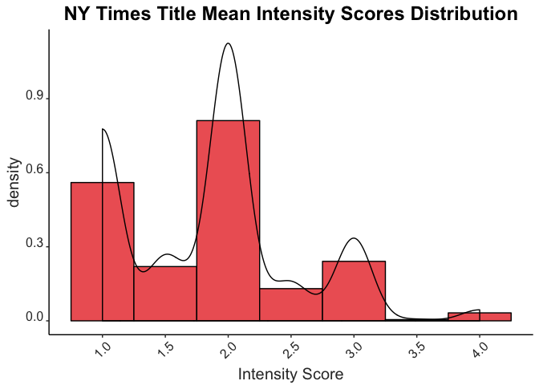

Text Analysis
================

Your mission
============

Perform text analysis.

Okay, I need more information
-----------------------------

Perform sentiment analysis or topic modeling using text analysis methods as demonstrated in the pre-class work and in the readings.

Okay, I need even more information.
-----------------------------------

Do the above. Can't think of a data source?

-   `gutenbergr`
-   `AssociatedPress` from the `topicmodels` package
-   `NYTimes` or `USCongress` from the `RTextTools` package
-   Harry Potter Complete 7 Books text \`\`\` if (packageVersion("devtools") &lt; 1.6) { install.packages("devtools") }

devtools::install\_github("bradleyboehmke/harrypotter") \`\``- [State of the Union speeches](https://pradeepadhokshaja.wordpress.com/2017/03/31/scraping-the-web-for-presdential-inaugural-addresses-using-rvest/) - Scrape tweets using [`twitteR\`\](<https://www.credera.com/blog/business-intelligence/twitter-analytics-using-r-part-1-extract-tweets/>)

Analyze the text for sentiment OR topic. **You do not need to do both**. The datacamp courses and [Tidy Text Mining with R](http://tidytextmining.com/) are good starting points for templates to perform this type of analysis, but feel free to *expand beyond these examples*.

Timelines and Task
==================

We will spend the next 2 weeks working on analyzing textual data in R. You will do the following:

-   Start with some text based data.
-   Clean data and prepare it for analysis
-   Ask questions about the data
-   Answer these questions with the data using tables and graphics
-   Each group member must have their own unique question that they code the answer for.

SET UP
------

``` r
# Get libraries
library(tidytext)
```

    ## Warning: package 'tidytext' was built under R version 3.4.2

``` r
library(dplyr)
```

    ## Warning: package 'dplyr' was built under R version 3.4.1

    ## 
    ## Attaching package: 'dplyr'

    ## The following objects are masked from 'package:stats':
    ## 
    ##     filter, lag

    ## The following objects are masked from 'package:base':
    ## 
    ##     intersect, setdiff, setequal, union

``` r
library(rebus)
library(stringr)
```

    ## 
    ## Attaching package: 'stringr'

    ## The following object is masked from 'package:rebus':
    ## 
    ##     regex

``` r
library(ggplot2)
```

    ## 
    ## Attaching package: 'ggplot2'

    ## The following object is masked from 'package:rebus':
    ## 
    ##     alpha

Prepare Titles and Sentiment Scores
-----------------------------------

``` r
# Get Data
library(RTextTools)
```

    ## Loading required package: SparseM

    ## 
    ## Attaching package: 'SparseM'

    ## The following object is masked from 'package:base':
    ## 
    ##     backsolve

``` r
data(NYTimes)


# Get dictionary with sentiment scores using lexicon afinn 
sentiment.scores = as.data.frame(get_sentiments("afinn"))

# Prepare the titles as strings by converting title to characters
NYTimes$title = (as.character(NYTimes$Title))
```

Sentiments of NY Times Titles
=============================

Intensity of Negative and Positive Words in NY Times Titles
-----------------------------------------------------------

This section looks at what the frequency distribution of the intensity of negative and positive words used in the NY Times titles are.

``` r
# Create a data frame that will contain the sentiment scores for each word in the title
scores = NYTimes %>%
  # group the data by title
  group_by(Title) %>%
  # get each word from the title out by unnesting
  unnest_tokens(output=word, input=title) %>%
  # get the sentiment scores for each word in the title 
  inner_join(sentiment.scores) %>%
  # get a mean of the score for each word in the title to get an average sentiment score for each title 
  summarize(title.score = mean(score))
```

    ## Joining, by = "word"

``` r
# plot mean scores for each title 

ggplot(scores,aes(title.score)) + 
  labs(x = "Mean Score") +
  geom_histogram(color="black",fill="lightblue1",aes(y=..density..), binwidth=1) +
  geom_density() + 
  scale_x_continuous(breaks = pretty(scores$title.score, n = 10)) +
  ggtitle("NY Times Title Mean Sentiment Scores Distribution") +
  theme(plot.title = element_text(color="black", face="bold", size=18,hjust = 0.5)) +
  #theme_bw() + 
  theme(panel.border = element_blank(), panel.grid.major = element_blank(),
        panel.grid.minor = element_blank(), axis.line = element_line(colour = "black")) +
 theme(panel.background = element_rect(fill='white')) +
  theme(axis.text.x = element_text(colour="grey20",size=12,angle=45,hjust=.5,vjust=.5,face="plain"),
        axis.text.y = element_text(colour="grey20",size=12,angle=0,hjust=1,vjust=0,face="plain"),  
        axis.title.x = element_text(colour="grey20",size=15,angle=0,hjust=.5,vjust=0,face="plain"),
        axis.title.y = element_text(colour="grey20",size=15,angle=90,hjust=.5,vjust=.5,face="plain"))
```


This plot shows the frequency of the mean intensities of positive/negative words used in the titles. A higher absolute value indicates greater intensity of an emotion in words for the title, whereas a lower one indicates less intensity. Negative numbers indicate negative emotions whereas positive numbers indicate positive emotions.

From this plot, it looks like most of the titles tend to have a negative sentiment. Less of the titles tend to be in the extremes of both types of emotions and in neutral sentiment.

Absolute Intensity of Words Used in NY Times Titles
---------------------------------------------------

This section looks at just how intense the emotions of the words in NY Times titles are (i.e., it doesn't matter whether the emotions are negative or positive; we are just interested in how extreme these emotions get).

``` r
# We do the same thing as Part 1a except now, if the scores are negative, we get the absolute value of them.

# Create a data frame that will contain the sentiment scores for each word in the title
scores = NYTimes %>%
  # group the data by title
  group_by(Title) %>%
  # get each word from the title out by unnesting
  unnest_tokens(output=word, input=title) %>%
  # get the sentiment scores for each word in the title 
  inner_join(sentiment.scores) %>%
  # get the absolute value of the sentiment scores so that we get the intensity score
  mutate(intensity.score = abs(score))
```

    ## Joining, by = "word"

``` r
# get a mean of the intensity for each titles 
scores = scores %>% 
  group_by(Title) %>%
  summarize(title.intensity.score = mean(intensity.score))

# plot mean scores for each title 
ggplot(scores,aes(title.intensity.score)) + 
  # label the x-axis 
  labs(x = "Intensity Score") +
  # create histogram with a density curve
  geom_histogram(color="black",fill="indianred2",aes(y=..density..), binwidth=0.5) +
  geom_density() + 
  # label the x-axis tick marks in a way that's intuitive
  scale_x_continuous(breaks = pretty(scores$title.intensity.score, n = 10)) +
  # make the title nice
  ggtitle("NY Times Title Mean Intensity Scores Distribution") +
  theme(plot.title = element_text(color="black", face="bold", size=18,hjust = 0.5)) +
  # get the background to be white and get rid of the grid marks
  theme(panel.border = element_blank(), panel.grid.major = element_blank(),
        panel.grid.minor = element_blank(), axis.line = element_line(colour = "black")) +
 theme(panel.background = element_rect(fill='white')) +
  # make the axis tick marks and text look nicer 
  theme(axis.text.x = element_text(colour="grey20",size=12,angle=45,hjust=.5,vjust=.5,face="plain"),
        axis.text.y = element_text(colour="grey20",size=12,angle=0,hjust=1,vjust=0,face="plain"),  
        axis.title.x = element_text(colour="grey20",size=15,angle=0,hjust=.5,vjust=0,face="plain"),
        axis.title.y = element_text(colour="grey20",size=15,angle=90,hjust=.5,vjust=.5,face="plain"))
```



Here, it looks like most of the titles do not have an extreme intensity in their sentiment. Rather, they tend to be in the mid to lower range in terms of their sentiment intensity.

Emotions and Intensity Over Time
--------------------------------

How is does the sentiment of the title differ over time?

``` r
############# Get years and scores

#1. Convert Dates to Strings

# make the date as characters
NYTimes$Date = as.character(NYTimes$Date)

# now convert the date to strings
for (i in 1:length(NYTimes$Date)){
NYTimes$Date[i] = toString(NYTimes$Date[i])
}

#2. Extract the Year
# create a pattern for how the year will look like
year_pattern = DGT %R% DGT %R% END
# get the year using this pattern and put this year in our data frame with scores
NYTimes$year = str_extract(NYTimes$Date, pattern=year_pattern)

# now, create a new data frame that will contain the sentiment scores for titles by year

# first, get the mean sentiment scores for each title
scores2 = 
NYTimes %>% 
  group_by(Title, year) %>%
   # get each word from the title out by unnesting
  unnest_tokens(output=word, input=title) %>%
  # get the sentiment scores for each word in the title 
  inner_join(sentiment.scores) %>%
  # mean score
  summarize(title.score = mean(score))
```

    ## Joining, by = "word"

``` r
# now, group by year so that we get a mean sentiment score for each year  
scores2 =
  scores2 %>%
  group_by(year) %>%
  summarize(year.score = mean(title.score))

# create a new data frame to get the absolute value for each year so that we get intensity scores

scores3 = 
  scores2 %>% 
  mutate(year.intensity = abs(year.score))

# change the years to be numeric
scores2$year = (as.numeric(scores2$year))

# change the years to be from year 1 to year 10 by making 1996 as year 1 and 2006 as year 10 
scores2 = scores2 %>% 
  mutate(year.num = ifelse(scores2$year<=6, 10-scores2$year, abs(96-scores2$year)))
scores3$year.num = scores2$year.num
```

``` r
####### Plot Mean Sentiment Scores
# This plots the sentiment scores
ggplot(data=scores2, aes(x=year.num,y=year.score)) +
  geom_line(color="steelblue4", linetype="dashed") +
  labs(x = "Year", y = "Mean Score") +
  scale_x_continuous(breaks = pretty(scores2$year.num, n = 10),labels=c(1996:2006)) +
  scale_y_continuous(breaks = pretty(scores2$year.score, n = 8)) +
  geom_point(size=3,color="steelblue4") +
  ggtitle("NY Times Mean Title Sentiment Scores Over Time") +
  theme(plot.title = element_text(color="black", face="bold", size=18,hjust = 0.5)) +
  #theme_bw() + 
  theme(panel.border = element_blank(), panel.grid.major = element_blank(),
        panel.grid.minor = element_blank(), axis.line = element_line(colour = "black")) +
  theme(panel.background = element_rect(fill='white')) +
      theme(axis.text.x = element_text(colour="grey20",size=12,angle=0,hjust=.5,vjust=.5,face="plain"),
        axis.text.y = element_text(colour="grey20",size=12,angle=0,hjust=1,vjust=0,face="plain"),  
        axis.title.x = element_text(colour="grey20",size=15,angle=0,hjust=.5,vjust=0,face="plain"),
        axis.title.y = element_text(colour="grey20",size=15,angle=90,hjust=.5,vjust=.5,face="plain"))
```


It looks like sentiment tends to decrease until 1998. From 1998 to 2000, sentiment scores increase (i.e., tend to be more positive) but starts decreasing again starting at year 2001. From 2001 to 2003, titles tend to be more negative but they start becoming positive moving forward.

``` r
# This plots the intensity scores
ggplot(data=scores3, aes(x=year.num,y=year.intensity)) +
  geom_line(color="firebrick3", linetype="dashed") +
  labs(x = "Year", y = "Mean Intensity") +
  scale_x_continuous(breaks = pretty(scores3$year.num, n = 10),labels=c(1996:2006)) +
  scale_y_continuous(breaks = pretty(scores3$year.intensity, n = 8)) +
  geom_point(size=3,color="firebrick3") +
  ggtitle("NY Times Mean Title Sentiment Intensity Over Time") +
  theme(plot.title = element_text(color="black", face="bold", size=18,hjust = 0.5)) +
  #theme_bw() + 
  theme(panel.border = element_blank(), panel.grid.major = element_blank(),
        panel.grid.minor = element_blank(), axis.line = element_line(colour = "black")) +
  theme(panel.background = element_rect(fill='white')) +
      theme(axis.text.x = element_text(colour="grey20",size=12,angle=0,hjust=.5,vjust=.5,face="plain"),
        axis.text.y = element_text(colour="grey20",size=12,angle=0,hjust=1,vjust=0,face="plain"),  
        axis.title.x = element_text(colour="grey20",size=15,angle=0,hjust=.5,vjust=0,face="plain"),
        axis.title.y = element_text(colour="grey20",size=15,angle=90,hjust=.5,vjust=.5,face="plain"))
```


Now we can look at just the absolute intensity of the sentiment (regardless of whether the words are positive or negative).

Here, we see that the emotional intensity of the titles increases from 1996 to 1998. They decrease until around 2000/2001. Starting from 2001 to 2003, the intensity of the sentiment increases, but they decrease starting from 2003 to 2006. However, it is worth noting that the actual intensity remains lower, indicating that the sentiment intensity of the titles in NY Times do not tend to be high over time.
