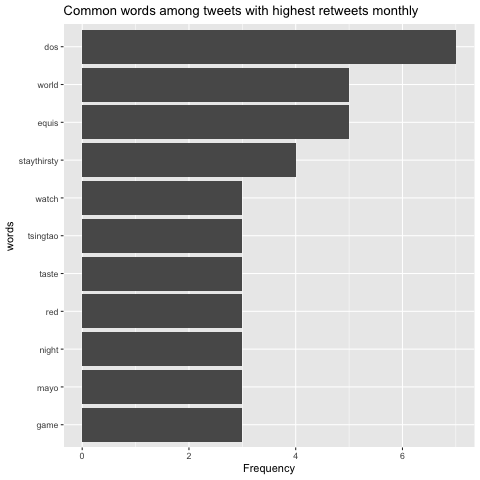

## Background 
We grabed tweets from five beer companies' official accounts and did text-mining analysis. The five companies are Bud lite, Dos Equis, Guinness, Blue Moon, and Tsingtao. I focused on text data about Tsingtao, and the question for me was "What are the common words among tweets which have highest retweets in each month".

## The Data

We got the data by using the package twitteR. I defined the username as

```
@Tsingtao
```

Our function also allows us to enter in information on dates and number of tweets. 

## The Graph

Below is the popular words among tweets with highest retweets in each month:


## Basic Information

The table below display the number of month each company has the highst retweets

```{r, echo=FALSE}
library(dplyr)
load("data/retweets.Rda")
table<-as.data.frame(table(retweets$screenName))
names(table) <-c("Brand", "Count")
knitr::kable(table)
```