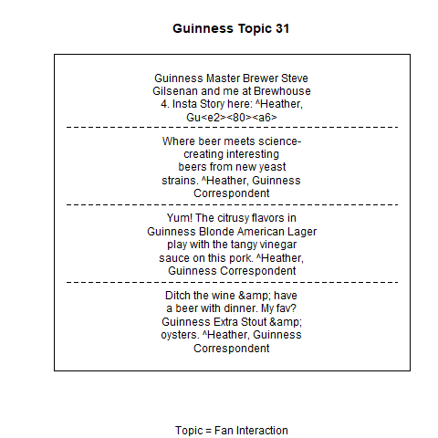
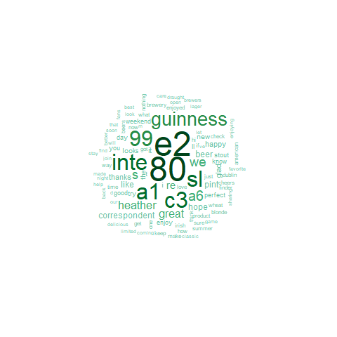

For this project we were interested in exploring twitter data on beer companies. Our inital thought was to look at twitter marketing aimed toward youth. With limited access to age data from twitter (a paid data source) we redefined our questions listed below.

# Process

We choose 5 brands of beer from different multinational companies around the world for our analysis.Budlight, Dos Equis, Guinness U.S., Blue Moon and Tsingtao. Each of us cleaned the data for our assigned beer companies and we merged our clean data. Our data wrangleing file was sent to you separately due to twitter authorization code privacy.

# Our data visualization files answering our respective questions above are attached:

* The only file you need to run is the makefile.R

# Questions

1. Derrick, Sentiment Analysis by day of the week, Does sentiment analysis change over the course of the week by each beer company?

Here is the density of sentiment scores for all beer companies. As we see, the vast majority of sentiments are positive, which makes sense for the alcohol industry. However, once we break it down per individual company, we see that they differ a little bit. Most notable, is how much more positive the Blue Moon tweets are than every other company. Also interesting to note that the positivity does not increase that significantly as the week approaches the weekend. This significance could be tested with a linear regression model.


2. Michael, Thematic Topic Modeling, What are the most popular topics overall? 

I implemented structural topic modelling, which allows the use of metadata in the modelling process. After running the model a couple of times, I found the appropriate number of topics to be about 53. From there, I did some basic data wrangling to find out which topic was most frequently tweet, and by which company. I crossed referenced that with the most favorited topic (again by company). Unsurprisingly I found that the most favorited topics tend to be the ones they tweet about the most.  However, what was interesting to see was how DosEquis, who didn't tweet as much as the others, had the best ratio for tweets to favorites, and the topic of these tweets was about "The Most Interesting Man," whereas the others mostly promoted their new beers, or some kind of brand competition. The one that did the second best was Budlight, who tweeted about football. 
From this, I could tell that brands needs to work on their social media identity (or identity in general) if they want more engagement.





3. Tess, What are the most popular topics on Saturdays across the 5 companies? 

As we would expect, all 5 companies have different "top 5 topics" that are tweeted about the most. Budlight and Blue Moon consistently tweet about all 5 of their top 5 topics on twitter. There is less variation in the counts across the five respective topics for both of these beer companies. This contrasts with Dos Equis, Tsingtao and Guiness US which each tweet primarily about one topic the most. Among all 5 companies Tsingtao had the least amount of tweets across their top 5 topics (n= 16), and Blue Moon had the most tweets across their top 5 topics (n=258). 


4. Lisha, Among the highest retweets each month, which are the most popular words? 

The most popular words among tweets with monthly highest retweets are world and dos. Both of them appear 6 times. Dos is the brand name, and in the past few years, 50 tweets published by DosEquis got highest retweets in the month they had been published, which exceeds all other companies' tweets. We can conclude that DosEquis is the most influential twitter account among the five beer companies' accounts. Other popular words such as game, party, and night describe the time and places that people drink beers, which corresponds to our impression. 

Below is the popular words among tweets with highest retweets in each month:


The table below display the number of months each company has the highest retweets

```{r, echo=FALSE}
load("data/retweets.Rda")
table<-as.data.frame(table(retweets$screenName))
names(table) <-c("Brand", "Count")
knitr::kable(table)
```


5. David, What are the most frequently used words by each company?


The words most frequently used throughout all 5 companies were "Beer" and "Cheers" among all of the beer companies we analyzed. However, some companies such as Guinness and Tsingtao also tweeted their own name brand at a high frequency while Dos Equis' most frequently tweeted the phrase 'staythirsty' in reference to their brand's catch phrase.




